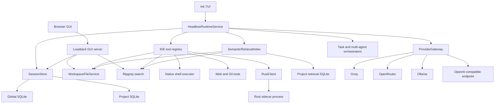
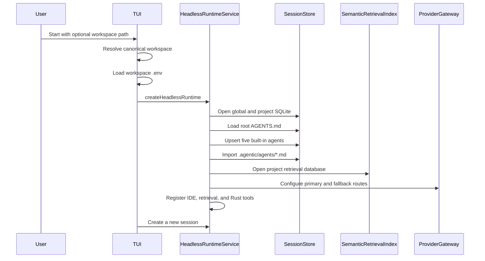
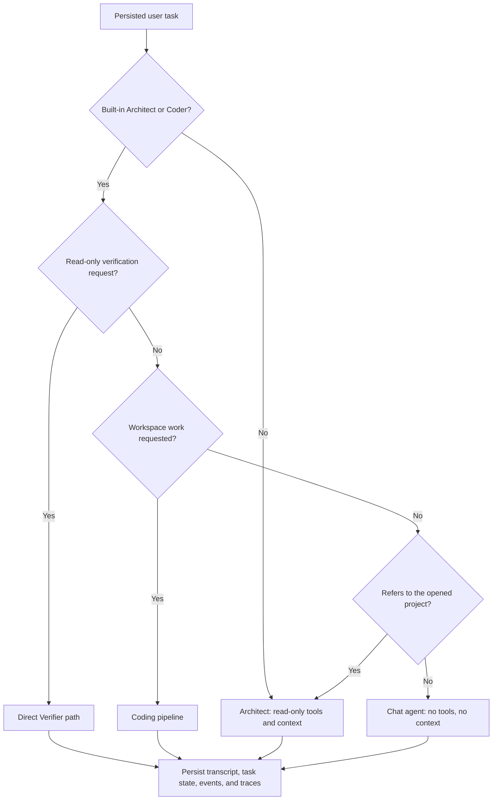
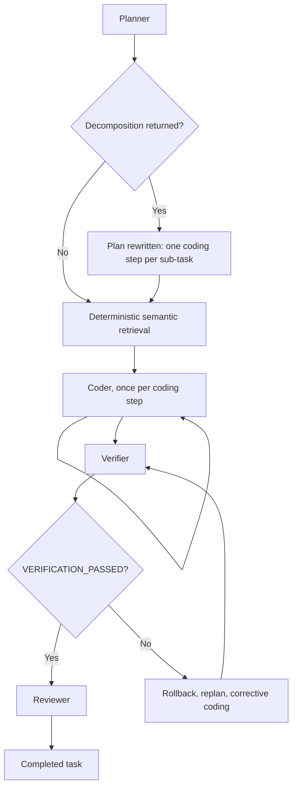
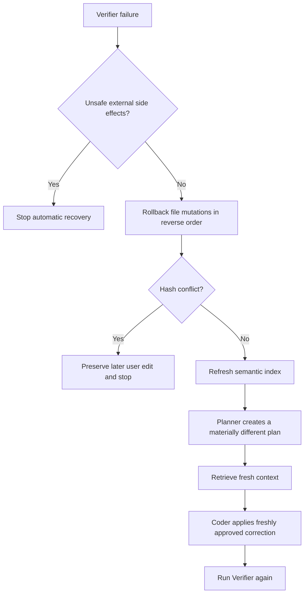

# Architecture and Implementation Status

## Document purpose

This document describes the architecture that exists in the current source tree.
It separates working behavior from target behavior and records known gaps without
papering over them.

The source code is the ground truth. Older planning documents still contain
parts of the original Tauri, FlatCPG, structural diff, Rust WAL, and routing
vision. Those parts are treated as plans unless the current runtime actually
calls them.

## System summary

The project is a TypeScript-first agentic coding runtime with a small Rust
sidecar. The TypeScript packages own orchestration, model routing, persistence,
retrieval, tools, approvals, recovery policy, and client-facing services. The
Rust process handles selected syntax and diff operations through a typed JSON
RPC boundary.

The only complete interactive runtime client today is the Ink TUI. The browser
GUI is a read-only workbench and provider settings client. It is not connected
to task execution yet.

The main coding path is a sequential five-stage pipeline:

1. Planner
2. Deterministic semantic retriever
3. Coder
4. Verifier
5. Reviewer

Read-only requests to run tests, builds, lint, type checks, syntax checks, or
format checks take a shorter path directly to the Verifier. Other conversational
and custom-agent requests use the registry-driven multi-agent path.

## Top-level architecture



### Runtime ownership

`HeadlessRuntimeService` is the application boundary. It owns:

- Session and task lifecycle
- Built-in and project agent registration
- Provider and model composition
- Tool registry composition
- Task routing
- Task cancellation
- Approval requests
- Runtime event delivery
- Pipeline checkpointing
- Recovery state
- Manual context
- Isolated questions
- Event and trace persistence

The TUI consumes this service. Browser code does not import Node-only packages.
A future IDE transport should expose this same service rather than reimplementing
runtime behavior in the GUI.

## Startup flow



### Detailed startup steps

1. `packages/tui/src/index.tsx` resolves the workspace argument.
2. It loads `.env` from the workspace unless `ENV_FILE` points elsewhere.
3. `packages/tui/src/app.tsx` converts environment variables into a primary
   provider/model route and optional fallbacks.
4. `createHeadlessRuntime()` opens `SessionStore` for the canonical project root.
5. `SessionStore` opens one global SQLite database and one project SQLite
   database.
6. The runtime loads the root `AGENTS.md` file as project instructions.
7. The runtime upserts the built-in Architect, Retriever, Coder, Verifier, and
   Reviewer definitions.
8. Project agent definitions from `.agentic/agents/*.md` are imported into the
   global agent registry, except for reserved built-in IDs.
9. The runtime opens a project-specific semantic retrieval database beside the
   project session database.
10. The runtime creates one provider gateway and one model resolver.
11. The runtime creates complete tool registries on demand and scopes them per
    agent.
12. The TUI creates a new session.

The TUI does not automatically reopen the latest session. Persistence supports
saved sessions, but current presentation code starts a new one each time.

## Task routing

Task routing happens inside `HeadlessRuntimeService.executeTask()`.

Routing is automatic by default. The composer runs the Architect agent, which is
the entry point to the decision below, and the user is never asked to classify
their own prompt. Selecting a different agent is an explicit override for that
turn, and only two are offered: Architect ("Auto") and Coder, plus any agents the
project ships under `.agentic/agents`. Retriever, Verifier, and Reviewer are
pipeline _stages_ rather than modes — running a verifier standalone means
verifying nothing — and Chat is chosen automatically for prompts that need no
project access, so all four are hidden from the picker. `isSelectableAgent`
owns that distinction in the runtime, and clients read it from the workbench
API rather than hardcoding agent IDs.



Routing precedence matters:

1. Verification-only routing is checked first.
2. Coding-pipeline routing is checked second.
3. A question about the opened project uses the Architect, which has read-only
   tools and the session context but cannot mutate anything.
4. Everything else uses the tool-free chat agent.

The last two steps are one distinction, and getting it wrong is not symmetric.
"What is a closure" is answerable from the model's own knowledge, so the chat
agent is both cheap and correct. "What files are in this repo" is not: both are
explanation requests, so neither is workspace _work_, but routing the second to
an agent with no tools and no context produces a confident invention. The
workspace reference is what separates them.

None of these four paths lets a general question reach the Coder. A prompt only
reaches a mutation-capable agent when `requestsWorkspaceWork` is true, which
requires an artifact request, a workspace reference, or a bare action verb — and
which returns false outright for anything shaped as a question.

### Verification-only routing

A request routes directly to the Verifier when all of the following are true:

- The selected agent is the built-in Architect or Coder.
- The request asks to run, execute, rerun, check, or verify tests, a suite, a
  build, lint, type checking, syntax checking, or format checking.
- The request either explicitly forbids mutation or does not contain an
  implementation-oriented mutation keyword.

Examples that take this path:

- "Run the tests without modifying files."
- "Check the build and lint results."
- "Verify the typecheck only."

The Verifier receives:

- Its own verifier system prompt
- Root project instructions loaded from `AGENTS.md`
- Prior session history
- Manual session and task context
- The current user request
- Only verifier-scoped tools

Handoffs and coding workflow continuation are disabled for this path. This
prevents a read-only check request from entering Planner, Retriever, Coder, and
Reviewer stages merely because words such as `build` or `test` also appear in
the broader coding heuristic.

### Coding-pipeline routing

After verification-only routing is ruled out, prompts from the built-in
Architect or Coder enter the fixed pipeline when they contain a coding keyword
such as:

- add
- build
- change
- create
- debug
- delete
- edit
- fix
- implement
- migrate
- modify
- patch
- refactor
- remove
- rename
- test
- update
- write

This is a regular-expression heuristic, not a semantic classifier. Ambiguous
prompts can still take the wrong path.

### Direct registry-driven routing

The direct path handles:

- Conversation
- Read-only questions that are not verification commands
- Research
- Custom agents
- Explicitly selected non-built-in agents
- Requests that do not match the coding heuristic

The direct path creates a `MultiAgentOrchestrator`, resolves the selected agent,
scopes its tools, and runs `AgentRunner`. If handoffs are enabled, the agent can
use `handoff_agent` to invoke another registered agent.

## Five-stage coding pipeline



The pipeline has a fixed _shape_ but not a fixed _length_. The static plan
carries a single placeholder coding step; the Planner may replace it with two to
four narrowly scoped ones. See "Planner-driven decomposition" below.

### 1. Planner

The Planner uses the built-in `general` agent definition, named Architect in the
prompt. It receives the original objective, prior session history, project
context, and earlier stage results when relevant.

Its job is to produce a small, testable plan. It has read-only tools and cannot
mutate the workspace.

### 2. Retriever

The pipeline Retriever is deterministic. It is not an LLM call and does not use
the registered Retriever agent definition.

It queries the semantic retrieval index using:

- The original objective
- The Planner output

The live pipeline requests up to ten slices with a maximum of forty lines per
slice.

### 3. Coder

The Coder receives:

- The objective
- The current project and manual context
- Planner output
- Retrieval output
- Other completed stage summaries

It has workspace mutation tools, read-only Git inspection, shell tools, semantic
retrieval, and Rust analysis tools. Mutations and shell-backed tools still pass
through approval.

### 4. Verifier

The Verifier receives project instructions as part of its system prompt. It is
expected to:

- Run syntax or compile checks
- Run relevant tests
- Inspect the Git diff
- Report exact commands and failures
- End with `VERIFICATION_PASSED` only when checks pass

The runtime treats verification as passed only when the final text ends with an
exact `VERIFICATION_PASSED` marker on its own line.

### 5. Reviewer

The Reviewer receives the plan, retrieval evidence, implementation result, and
verification result. It is read-only and produces the final user-facing summary.
It does not run commands or modify files.

### Planner-driven decomposition

Fixing the number of coding steps in advance was wrong for the tasks this
system is built for. A five-stage pipeline with exactly one Coder call gives a
small model one shot at an objective that may span several files, and no amount
of prompt engineering makes a 7B model emit four correct mutations from one
turn.

So the Planner decides the shape. Its reply may end with a fenced `subtasks`
block, and when it does the orchestrator replaces the placeholder `code` step
with one step per sub-task. Each Coder call then receives only its own slice of
the objective, plus the shared retrieval evidence.

Dependencies are rewired rather than reassigned by hand: the first inserted step
inherits the placeholder's dependencies, so it still waits for retrieval, and
anything that depended on the placeholder — the Verifier — now depends on the
last inserted step, so verification still runs over the whole change.

Three properties matter more than the mechanism:

- **It degrades to the old behavior.** Missing block, malformed JSON, a
  single-entry list, entries with no prompt: all yield no expansion and the
  single generic coding step runs. A small model that cannot produce structured
  output loses nothing.
- **It is bounded.** At most four sub-steps. Every extra step is another model
  call, so an over-eager split is a real cost, and the Planner is told
  explicitly not to split work that touches one file.
- **It survives a restart.** Accepted expansions are stored in the
  orchestration state and replayed against the static plan on resume, so a task
  interrupted midway through a decomposed run continues on the same step list
  instead of rejecting `code-2` as an unknown step.

The rewrite is emitted as a `plan_expanded` event and recorded as its own
`plan_expansion` trace span, so the decomposition is visible in the dashboard
rather than only in the Planner's prose.

### Pipeline execution rules

The live pipeline is intentionally sequential. This avoids multiple agents
editing the same working tree at once.

Current limits are:

- Two attempts per stage
- Ten stage attempts in total
- Forty-eight model requests per task
- Thirty minutes per runtime execution or resume invocation
- One hundred ninety-two tool calls per multi-agent run
- $0.50 of real provider spend per task

These are set against the evaluation's scoring formula rather than chosen as
round numbers. Accuracy is multiplied by ten while time enters a penalty
denominator, so a run halted just short of a correct answer scores far worse
than the same run taking longer to finish. The ceilings sit below the 2700 s and
$0.50 hard limits with margin and exist as runaway protection, not as a target.

Completed stages are checkpointed in project SQLite. `resumeTask()` reloads the
checkpoint and skips completed stages.

The model-request count survives resume. The wall-clock window starts again for
each resume invocation, so it is not a cumulative task lifetime budget.

## Registry-driven multi-agent behavior

`MultiAgentOrchestrator` is the general agent execution boundary. It does not
hardcode roles.

An `AgentDefinition` contains:

- Stable ID
- Name and description
- System prompt
- Capability labels
- Optional allowed tool list
- Optional delegation target
- Optional model-step limit
- Enabled state

The orchestrator:

1. Loads an agent by ID.
2. Resolves its model.
3. Resolves the full tool registry.
4. Enforces `allowedTools` in code.
5. Adds `handoff_agent` when handoffs are enabled.
6. Runs the generic model and tool loop.
7. Returns a child handoff result to the parent as a tool result.

Handoffs are nested and sequential. They are bounded by:

- Maximum depth
- Maximum total handoffs
- Maximum handoffs per source and target pair
- Duplicate active handoff detection
- Shared model-request budget
- Shared duration budget
- Cancellation

The resolver interface allows different models per agent, but the default
runtime composition returns the same provider gateway for every agent. Per-role
model selection is not implemented yet.

## AgentRunner model and tool loop

`AgentRunner` is provider-neutral. It owns one model/tool conversation, not an
agent identity.

For each step it:

1. Estimates the provider-visible request size.
2. Compacts context if needed.
3. Calls the selected `LanguageModel`.
4. Appends the assistant message.
5. Validates every tool call with Ajv.
6. Prepares an approval preview when required.
7. Requests approval before side effects.
8. Executes approved tools.
9. Returns structured tool results to the model.
10. Continues until a final answer or a safety stop.

### Loop protection

The runner caches tool calls by tool name, arguments, and workspace revision.
An identical call against an unchanged workspace reuses a concise skip result
rather than repeating the operation and copying a large result into context.

After four duplicate cached calls, the run stops with a visible safety message.
There is also a per-agent step limit and a shared multi-agent model-request
limit.

### Workflow continuation

For explicit coding requests, the runner can require follow-through stages such
as mutation, reread, and verification. If a model stops after an intermediate
read or edit, the runner can add a focused continuation message.

This continuation is disabled for verification-only routing and other paths
where mutation follow-through is not appropriate.

## Provider architecture

### Provider-neutral boundary

`LanguageModel` exposes:

- `respond(request)`
- Optional context estimation

Responses can include:

- Assistant text
- Structured tool calls
- Token usage
- Timing
- Provider and model IDs
- Cost when known
- Response metadata

### Runtime providers

The gateway registers:

| Provider          | Protocol               | Credential behavior                        |
| ----------------- | ---------------------- | ------------------------------------------ |
| Groq              | OpenAI-compatible chat | Stored key, then environment fallback      |
| OpenRouter        | OpenAI-compatible chat | Stored key, then environment fallback      |
| Ollama            | `/api/chat`            | Local endpoint, no key required by default |
| OpenAI-compatible | OpenAI-compatible chat | Configurable URL and optional key          |

`@agentic-runtime/openai` also contains an OpenAI Responses adapter, but the
default runtime gateway does not register a provider named `openai`.

### Route construction

The TUI builds a primary route from `MODEL_PROVIDER` and matching model settings.
Configured model variables can add fallbacks. Saved provider settings override
route model IDs and base URLs.

Credentials resolve in this order:

1. Global SQLite provider credential
2. Provider-specific environment variable fallback

The default runtime registers selected routes manually rather than requiring
provider model discovery at startup.

### Ranking

Ranking happens in two layers. Eligibility is absolute and is decided first:

1. Tool support
2. Estimated context fit
3. A stage-specific context-window floor, when the route policy sets one
4. Cooldown state

Order among eligible routes is then decided by the request's `bias`:

| Bias       | First sort key                      | Used for                                        |
| ---------- | ----------------------------------- | ----------------------------------------------- |
| `balanced` | operator preference order           | ordinary coding work (the default)              |
| `capacity` | largest known total parameter count | planning a complex task, verification, review   |
| `economy`  | lowest estimated cost               | retrieval summarisation, chat, trivial requests |

Remaining ties fall through preference order, estimated cost, context-window
size, and finally a stable provider/model ordering.

A bias only reorders routes that are all already eligible, so it can never
promote a model that cannot serve the request. `capacity` treats an unknown
parameter count as zero rather than as large: a model is only promoted above the
operator's configured order on positive evidence that it is bigger. A window
floor is a preference, not a constraint — if nothing clears it, ranking is
repeated without it rather than failing a task a smaller window could have
completed.

Task complexity is a cheap syntactic classification of the prompt (length,
number of concrete file references, conjunction count, multi-step vocabulary),
not a model call. The two misclassifications are not symmetric: routing a hard
task down costs accuracy, which the scoring formula weights ten times; routing
an easy task up costs a fraction of a cent. `simple` is therefore narrow — a
short request that names no file — and everything that points at concrete code
stays on the operator's configured route.

### Failover

Retryable failures include:

- Rate limits
- Context-length errors
- Timeouts
- Connection errors
- Transient server errors

The gateway can try the next ranked route without rebuilding the request. The
same message and tool state is preserved. Retryable transient failures place a
route on cooldown. Authentication and invalid-request failures stop immediately.

Routing events include:

- Provider and model
- Attempt number
- Human-readable reason
- Estimated context tokens
- Estimated cost when available
- Failure classification

The TUI displays recent route and failover activity.

### Provider limitations

- There is no task-complexity signal.
- There is no per-agent model policy.
- Tokens already used by the task do not affect route choice.
- There is no task cost governor.
- The problem statement's `$0.50` ceiling is not enforced.
- The model parameter catalog has only two known entries.
- Unknown model sizes are marked `unverified` but remain usable.
- Runtime-created manual routes generally have unknown parameter counts.
- The clients do not display `unverified` status.
- There is no Ollama RAM or VRAM fit check.
- `OLLAMA_TIMEOUT_MS` is not wired through default gateway composition.
- Gateway-created Ollama requests currently use the adapter's 300-second
  default timeout.
- Model responses are not streamed token by token in current clients.

## Retrieval architecture

### Project isolation

Every canonical project root receives a distinct project ID — a SHA-256 of the
real path, so symlinks and case differences on Windows resolve to the same
project rather than two. Retrieval records include that project ID, so two
projects cannot see each other's files, symbols, or edges even when a database
path is shared in tests.

The default runtime stores `retrieval.db` beside the project's session database.

Isolation is enforced on three axes, and all three are covered by a test that
opens two projects against one shared data root:

| Axis                        | Mechanism                                       |
| --------------------------- | ----------------------------------------------- |
| Files, symbols, edges       | Per-project retrieval database plus project ID  |
| Sessions, tasks, traces     | Per-project session database plus project ID    |
| Agent definitions and rules | Per-project session database (see Persistence)  |
| Filesystem access           | Every tool is rooted at the canonical workspace |

Provider credentials and general settings stay global on purpose: an API key
belongs to the machine, not to a codebase.

### Session isolation

Conversations inside one project are isolated from each other as well. A secret
told to the agent in one session is not visible in another: the transcript is
stored per session, and every context item — pinned files, selected line ranges,
and the structured summaries compaction produces — carries the session that
created it and is queried by exact match.

That last part was tightened deliberately. The scoped query previously also
matched `session_id IS NULL`, which would have made any unscoped context item
visible in every conversation in the project. Nothing writes such an item, so it
was not leaking, but it left the isolation resting on every future caller
remembering to pass a session.

The boundary is the conversation, not the workspace. If the agent writes
something to a file, it is part of the codebase from that moment and retrieval
will find it from any session — which is correct, and is the limit worth stating
plainly rather than implying a stronger guarantee than exists. Trace spans are
likewise visible in the dashboard across sessions, because observability is the
user's own view of their own project; they are never fed back into another
session's prompt.

### Index contents

The retrieval database contains:

- Project records
- File hashes and metadata
- Symbols and line spans
- Definition, reference, call, import, and export edges

Extraction runs in three tiers, strongest first.

| Tier           | Languages                  | Produces                                           |
| -------------- | -------------------------- | -------------------------------------------------- |
| `typescript`   | TS, TSX, JS, JSX, MJS, CJS | Bindings-resolved symbols, imports, exports, calls |
| `tree-sitter`  | Python, Go, Rust, C, C++   | Parsed symbols, multi-line spans, attributed calls |
| `ripgrep-text` | everything else            | Regex declaration and import lines                 |

The middle tier runs in the Rust sidecar. It gives each language its own
visibility rule — Rust `pub`, Go's leading capital, C's `static`, Python's
underscore — real multi-line spans instead of single-line anchors, and a call
graph attributed to the enclosing function rather than to the file. TypeScript
and JavaScript deliberately stay in-process: the compiler API resolves bindings,
so its reference edges are real rather than name matches, and there is no IPC.

A sidecar that is missing or fails degrades that tier to the regex fallback
rather than failing the index, so a machine where the native binary did not
build still has a searchable project.

For TypeScript **and JavaScript** files, extraction uses the TypeScript compiler
API. The same parser handles both, so `.js`, `.jsx`, `.mjs`, and `.cjs` sources
get real structure instead of the regex fallback; `ScriptKind.JSX` is used for
plain `.js` because a `.js` file may legally contain JSX and that parse is a
superset for everything the extractor reads. Supported structural extraction
includes:

- Declarations
- Exported symbols
- Imports and exports
- Identifier references
- Calls
- Relative module edges
- Compact signatures

For other text languages, a lightweight regex extractor records common
definitions and imports. Ripgrep supplies path and text fallback.

### Incremental indexing

Indexing is a three-tier check, cheapest first:

1. **`stat` only.** If the file's size and mtime both match what was indexed,
   the content cannot differ in any way this index would see, and the file is
   skipped without being read. Agent writes always move mtime, so the agent's
   own edits are never missed.
2. **Read and hash.** If the stat differs, the file is read and hashed. A
   matching hash means it was touched but not changed — a rebuild, a checkout, a
   formatter writing identical bytes — and the new stat is recorded so the next
   pass takes tier 1.
3. **Re-extract.** Only a genuine content change replaces symbols and edges,
   transactionally.

Deleted files are removed from the index.

This matters because `query()` refreshes the index by default, so the warm pass
runs on essentially every retrieval. Reading and hashing every file each time
was the dominant cost: on this repository the warm pass went from roughly 750 ms
to 131 ms.

Generated, dependency, database, archive, binary, and common build paths are
ignored. Ignoring them at _discovery_ time rather than after the fact matters
more than it looks: ripgrep treats a positive `--glob` as an override that takes
precedence over `.gitignore`, so passing the wildcard `--glob "*"` silently
disabled every ignore file and turned a 116-file listing into a 40,000-file one,
mostly `node_modules`. That inflated every retrieval pass, leaked dependency
paths into agent context through `find_files`, and could trip the index's own
25,000-file ceiling on an ordinary project. Discovery now passes no positive
glob in the wildcard case and always pairs a caller-supplied pattern with
explicit exclusions.

### Query and ranking

Candidate ranking combines:

- Exact symbol match
- Partial symbol match
- Exported definition weight
- Definition, call, import, export, and reference edge weight
- File-path match
- Ripgrep text match
- One-hop graph neighbors
- Recent file modification

Results are compact file and line slices. The retrieval API does not normally
return entire files.

### Poor-result recovery

If the exact query returns no candidates, retrieval splits the query into
identifier and prompt terms and retries. If a query produces excessive
candidates, results are ranked and limited per file.

The response records whether retrieval was broadened, narrowed, or remained
empty.

### Retrieval limitations

- The TypeScript index is syntactic rather than fully type-checked.
- There is no full control-flow or data-flow graph.
- There is no LSP diagnostic integration.
- Failing-test locations are not explicit ranking signals.
- Languages outside TS/JS/Python/Go/Rust/C/C++ still use the regex fallback.
- No type resolution outside TypeScript, so an edge that names a symbol declared
  in several places attaches to all of them rather than to the right one.
- No data-flow or control-flow analysis; the graph is a symbol graph.
- There is no background file watcher.
- Queries re-run an incremental project scan by default; the scan is now
  stat-gated, so this is cheap, but it is still demand-driven rather than
  event-driven.
- Graph ranking depends on the sidecar; without it, retrieval falls back to
  symbol, edge, path, and text matching plus the one-hop expansion.

## Context compaction

Compaction runs inside `AgentRunner` before model requests and after provider
context-length failures.

### Trigger and targets

Default behavior:

- Trigger at 75 percent of usable context
- Compact toward 60 percent for normal threshold compaction
- Compact toward 45 percent after a context-limit error
- Keep at least two recent exchanges
- Allow up to four compaction passes
- Allow up to two context-limit recovery attempts
- Use an 8,192-token fallback window when the model has no known window
- Reserve 1,024 output tokens by default

### Compaction stages

1. Find `read_file` tool results.
2. Ask the Rust sidecar to prune supported source files to signatures.
3. Group assistant tool calls with their tool results.
4. Select old exchanges while retaining recent and current user exchanges.
5. Build a structured compact task state.
6. Replace removed history with a compaction system message.
7. Repeat if the request still exceeds the target.

The structured state retains bounded forms of:

- Current objective
- Plans
- Completed work
- Failures and rejected hunks
- Changed files and hashes
- Verification status
- Retrieved slices
- Project rules and system instructions
- Open questions

Compaction checkpoints are emitted as events and stored as task context and task
state by the headless runtime.

### Compaction limitations

- Token estimation falls back to roughly four characters per token.
- Structured extraction uses heuristics over message text.
- The runtime does not use a dedicated summarization model.
- Unsupported languages cannot use Rust signature pruning.
- Persisted compaction state supports restart context, but direct agent runs do
  not resume an exact in-flight model/tool turn.

## Tool architecture

### Tool registry

All tools implement provider-neutral core contracts. Each tool declares:

- Name
- Description
- JSON Schema arguments
- Approval policy
- Optional preview function
- Execute function

Ajv validates model-generated arguments before approval or execution. Hidden
tools can remain callable as delegation proxies without being advertised to the
model.

### Workspace tools

Implemented workspace tools:

- `list_directory`
- `read_file`
- `write_file`
- `create_file`
- `delete_file`
- `apply_patch`
- `find_files`
- `search_text`

Workspace paths are resolved against one root. Paths outside the root and
symlink traversal are rejected. Reads are UTF-8 text only and bounded by size.
Writes are atomic and conflict checked.

### Command tools

Implemented shell-backed tools:

- `run_command`
- `compile_code`
- `run_code`
- `format_code`
- `syntax_check`

Windows uses `cmd.exe`. Linux and macOS use `/bin/sh` unless configured
otherwise. Commands have timeout and output bounds, receive a restricted
environment, and inherit the runtime abort signal.

### Web tools

Implemented web tools:

- `browse_url`
- `crawl_site`

Web requests:

- Accept only HTTP and HTTPS
- Reject private and reserved network targets
- Do not execute page scripts
- Limit response size
- Bound redirects
- Bound crawl pages and concurrency
- Restrict crawling to the same domain

### Git tools

Read-only Git tools:

- `git_status`
- `git_diff`
- `git_log`
- `git_branches`

Approval-gated Git tools:

- `git_add`
- `git_commit`
- `git_checkout`
- `git_push`

Generated dependency and build directories are blocked from Git staging by the
specialized tool checks.

There is no Git merge tool. Built-in Coder permissions currently expose only
read-only Git inspection, so Git mutations require an appropriately configured
custom agent.

## Human-in-the-loop review

### Approval policy

Auto-approved operations include most local read-only workspace, search,
retrieval, Rust analysis, and Git inspection tools.

Approval-gated operations include:

- File mutations
- Shell commands
- Compile, run, format, and syntax commands
- Git mutations
- Web browsing and crawling

Web reads are approval-gated as a conservative network policy even though they
do not mutate the local workspace.

### File diff preparation

Before a file mutation, `WorkspaceFileService` creates:

- Workspace-relative path
- Base SHA-256 hash
- Proposed hash
- Unified text diff
- Stable line hunk IDs
- Original and replacement text for each hunk

Stable hunk IDs include path, line range, and content hashes.

### Partial approval

The TUI supports:

- Hunk navigation
- Per-hunk accept or reject toggles
- Apply selected hunks
- Accept all
- Reject all

Before applying approved hunks, the workspace service:

1. Rereads the file.
2. Verifies the base hash.
3. Rebuilds the proposal.
4. Verifies the approved preview still matches.
5. Applies accepted non-overlapping hunks.
6. Writes atomically.
7. Returns rejected hunks to the model.

A stale base fails closed. A partial approval does not silently apply rejected
content.

### HITL limitations

- The browser GUI has no approval transport or diff review.
- The GUI editor is read-only.
- The Rust diff engine is advisory and is not the source of approval hunks.
- TypeScript `diffLines` currently produces the authoritative file hunks.

## Persistence

### Global database

The global database stores only what is genuinely machine-wide:

- General settings
- Provider credentials
- Provider base URLs and model IDs
- Last provider validation result

Provider credentials are stored in plaintext. The database file is the current
secret boundary.

Agent definitions used to live here, and that was an isolation bug. A project
can ship its own agents under `.agentic/agents/*.md`, and those were registered
into the shared table, so opening project A and then project B left A's private
agents listed and selectable in B — a direct violation of the requirement that
agent memory must not cross projects. They now live in the project database,
which makes the isolation structural rather than a matter of query discipline:
the definitions are in a different file per project. The global table is
dropped on first open.

### Project database

The project database stores:

- Canonical project identity
- Sessions and transcripts
- Tasks and serialized task state
- Runtime events
- Manual and generated context items
- Orchestration checkpoints
- Recovery state
- Trace spans
- Agent definitions, including any the project ships itself

All queries are scoped to the current project ID, and the database file is
per-project as well, so isolation does not depend on every query remembering to
filter.

### Default data paths

On Windows:

```text
%LOCALAPPDATA%/agentic-runtime/global.db
%LOCALAPPDATA%/agentic-runtime/projects/<project-id>/project.db
%LOCALAPPDATA%/agentic-runtime/projects/<project-id>/retrieval.db
```

On Linux and macOS, the root defaults under `XDG_DATA_HOME` or
`~/.local/share/agentic-runtime`.

### SQLite journaling

SQLite databases use SQLite WAL journal mode. This provides normal SQLite
crash safety and is separate from the Rust memory-mapped `Wal` type.

### Resume behavior

Implemented resume behavior:

- Pipeline checkpoints are stored before and after stage work.
- Completed stages are skipped after restart.
- Stage attempts and failure fingerprints are persisted.
- The task-wide model-request count is persisted.
- Pending recovery state can be persisted.
- Paused model work restarts from the durable stage boundary.

Not implemented:

- Resuming an arbitrary shell process in place
- Resuming a provider HTTP request in place
- Exact durable checkpoints for every direct-path model and tool turn
- TUI task discovery and `/resume`
- Automatic reopening of the last session

## Recovery

### Intended verifier recovery flow



The runtime contains this recovery state machine. `WorkspaceFileService` also
contains real mutation preimages and hash-guarded rollback primitives.

### Disconnected default mutation journaling

The default file tools currently do not return the workspace mutation record in
`ToolResult.workspaceMutation`.

`WorkspaceFileService` creates a valid `mutation` record, but
`packages/tools/src/index.ts` returns changed status, review information, and
changed file hashes without forwarding that record.

`HeadlessRuntimeService` only journals mutations when a completed tool result
contains `workspaceMutation`. Therefore the default tools do not populate the
runtime recovery journal.

Current consequence:

- Recovery can detect verification failure.
- Recovery can persist its phase.
- Recovery can reindex, replan, retrieve, and recode.
- Recovery normally has no default file mutation records to roll back first.
- The documented end-to-end hash-guarded rollback behavior is not complete.

This is a core correctness issue and is higher priority than GUI work.

### External side effects

The runtime marks successful `coding-agent` calls to selected command and Git
mutation tools as untracked side effects. If such a side effect is recorded,
automatic rollback stops rather than guessing.

Limitations:

- Arbitrary command, Git, package-manager, network, and child-process effects
  cannot be safely reversed.
- Side-effect tracking is currently focused on the Coder.
- Verifier commands can potentially alter state but are not recorded as
  untracked recovery side effects.
- Direct-path custom agents have no workspace recovery journal equivalent.

## Tracing and observability

### Trace schema

The `trace_spans` table supports:

- Project, session, task, trace, and span IDs
- Parent span ID
- Span kind and name
- Status
- Serialized input and output
- Context artifacts
- Usage
- Cost
- Start, end, and duration
- Provider, model, agent, stage, and tool identifiers
- Error text

Secrets and sensitive field names are redacted before trace persistence.

### Spans currently created

The runtime currently creates useful spans for:

- Tasks
- Pipeline stages
- Agents
- Provider attempts
- Context compaction
- Isolated questions

Routing, task, pipeline, approval, agent, and tool events are also stored in the
project event log.

### Incomplete AgentRunner trace correlation

The event types allow correlation fields, but `AgentRunner` does not currently
populate them:

- `model_request` does not include a stable `callId` or the complete request.
- `model_response` does not include the matching `callId` or complete response.
- `tool_requested` does not include `spanId` and `parentSpanId`.
- `tool_completed` does not include matching span IDs.

The runtime tracing code expects those fields before it creates model and tool
spans.

Current consequence:

- Model-call spans are not created through the intended path.
- Tool spans are not created through the intended path.
- Provider-attempt spans often attach above the missing model-call level.
- Exact model inputs and outputs are not available as correlated model spans.
- Per-model usage and timing are not reliably captured in the hierarchy.
- The stored hierarchy is useful but incomplete.

`AgentRunner.toToolMessage()` also does not copy `ToolResult.contextArtifacts`
into tool-message metadata, which weakens context-artifact reconstruction.

This is another core correctness issue and must be fixed before building a GUI
dashboard on top of the trace API.

### Dashboard status

There is no live or historical observability dashboard. The headless runtime has
`listTraceSpans(taskId)`, but neither current client provides a complete trace
viewer.

A future dashboard should display safe progress summaries, tool rationale, and
recorded inputs and outputs. It should not expose private chain-of-thought.

## Rust sidecar

### Binary resolution and packaging

The sidecar path comes from `AGENTIC_RUST_PATH` when the host sets one, and
otherwise from `rust/target/release` then `rust/target/debug` in a source
checkout. Both halves were needed: the path used to be hard-coded to
`target/debug`, so a release build was never found, and a packaged desktop app
has no `rust/target` tree beside its JavaScript at all — the binary was simply
absent from the installer, which silently removed `analyze_code_structure`,
`compute_ast_diff`, and signature pruning from the shipped product.
`prepare-runtime-assets.mjs` now copies the binary next to ripgrep and the
desktop main process points `AGENTIC_RUST_PATH` at it.

A missing sidecar is a lost capability, not a failure: the two tools return a
tool error the model can read and compaction falls back to its
structured-exchange path, so ripgrep is fatal when absent and Rust is not. The
child process and all three of its pipes are unreferenced so an idle sidecar
cannot hold the host's event loop open, and `stopRustEngine()` is called when
the server closes so it does not outlive the application.

### Process boundary

`RustClient` lazily starts the Cargo-built executable and communicates through
newline-delimited JSON on stdin and stdout.

The bridge provides:

- Request IDs
- Typed client methods
- Per-request timeout
- Child spawn error handling
- Child exit handling
- Pending request rejection

`pnpm build` compiles the Rust crate before TypeScript so the expected debug
binary exists for local runtime use.

### Reachable methods

| RPC method     | Current behavior                        | Runtime use                   |
| -------------- | --------------------------------------- | ----------------------------- |
| `slice_ast`    | Extract named syntax blocks             | `analyze_code_structure` tool |
| `prune_ast`    | Replace function bodies with signatures | Context compaction            |
| `compute_diff` | Produce line-based LCS chunks           | `compute_ast_diff` tool       |
| `check_cycle`  | Compare supplied BLAKE3 snapshots       | Bridge test only              |

Tree-sitter support currently covers TypeScript/JavaScript, Python, and Rust.
Other languages use a lightweight declaration and indentation fallback for
slicing.

### Code property graph

`FlatCPG` holds the project's whole symbol graph in flat arrays, built from the
SQLite index and queried with personalised PageRank. Edges are resolved on the
TypeScript side, because only SQLite knows which of several same-named symbols
an edge should attach to; the sidecar owns the traversal.

This is what lets ranking follow a chain. The per-file expansion reaches a direct
caller and stops; PageRank from the matched symbols reaches the function three
calls away that a change actually breaks, and leaves a disconnected file out. The
reason string on each slice names the mechanism, so a user can tell why a file
they did not ask for is in their context.

One graph per project, keyed by the canonical project id, so two open codebases
cannot see each other's structure.

### Write-ahead log

`Wal` is the graph's on-disk format. A snapshot is bincode-encoded and appended
as an 8-byte little-endian length followed by the payload, so a truncated tail is
detectable on load rather than parsed as garbage. Each graph carries the index
revision it was built from; a fresh index adopts the persisted graph when the
revision still matches its database and rebuilds only when it does not.

### Merkle state tree

`StateTree` is workspace-level loop detection, complementary to the per-step
failure fingerprint. A run that edits a file, reverts it, and edits it again
succeeds at every step and produces different output each time, so a fingerprint
never fires — but the workspace has returned to a state it already occupied.
`check_cycle` hashes the changed files together with the action that produced
them and reports how many steps ago the same state was seen; the coding stage
stops as non-retryable when it repeats.

Only mutating stages are recorded. A read-only stage legitimately leaves the
workspace unchanged every time, and recording it would report a cycle for doing
its job correctly.

### Rust code that is not integrated

- The diff engine is line-based LCS, not an AST edit-distance engine.
- There is no three-way AST merge.
- TypeScript HITL approval does not use Rust diff chunks; the `diff` library
  remains authoritative for approval hunks, and the Rust engine backs the
  `compute_ast_diff` tool the coder calls.

The current sidecar is useful for syntax slicing, signature pruning, and an
advisory line diff. The larger Rust systems design remains planned.

## Clients

### TUI

The Ink TUI is the current runtime client.

Implemented capabilities:

- Workspace selection
- Provider and model selection from environment and stored settings
- New session creation
- Runtime task execution
- Route and failover activity
- Pipeline and agent activity
- Tool cards
- Approval prompts
- Per-hunk partial approval
- Cancellation
- Manual file and line context
- Isolated `/bytheway`
- Session and agent listing
- Agent selection
- Provider settings and validation

Current commands:

- `/help`
- `/new`
- `/clear`
- `/sessions`
- `/agents`
- `/agent [id]`
- `/settings`
- `/context`
- `/context add <file>[:line|start-end]`
- `/context remove <file>[:line|start-end]`
- `/bytheway <question>`
- `/exit`

Current TUI limitations:

- No `/resume`
- No task list
- No `/trace`
- No current agent CRUD commands
- No model picker command
- No clickable file or line references
- No token and cost summary
- No token-by-token model streaming
- Only the latest eight transcript messages are rendered

### Manual context

Manual context stores session-scoped snapshots of a complete file or selected
inclusive line range. It does not remain linked to future file changes.

A character budget limits selected context. Manual context is included in direct,
verification-only, and pipeline task context.

### Isolated questions

`/bytheway` uses one model call with:

- No prior transcript
- No manual task context
- No tools
- No handoffs
- No durable main-transcript mutation

After the isolated result, the original session history remains unchanged.

### GUI server

The GUI server binds to `127.0.0.1` and uses only `node:http`.

Implemented endpoints:

- `GET /api/project`
- `GET /api/files`
- `GET /api/files/content`
- `GET /api/search`
- `GET /api/providers`
- `PUT /api/providers/:id`
- `DELETE /api/providers/:id`
- `POST /api/providers/:id/validate`

It also serves the built Vite application.

The server uses the same global provider records as the TUI. API keys are
returned to the browser only as masked status, although the stored values remain
plaintext in SQLite.

The GUI server does not construct `HeadlessRuntimeService` and has no task or
event transport.

### Browser GUI

Implemented browser features:

- Activity bar
- Explorer
- Workspace directory browsing
- Workspace file reads
- Read-only Monaco editor
- Language workers
- Cursor and language status
- Provider settings
- Real provider validation
- Local-only chat preview

Not implemented in the browser:

- Runtime chat
- Task start, cancellation, or resume
- Agent selection
- Approvals
- Diff review
- File save
- Manual context controls
- `/bytheway`
- Clickable file and line references
- Routing activity
- Trace dashboard
- Live runtime events

## Package boundaries

| Package      | Responsibility                                                                | Key dependencies                        |
| ------------ | ----------------------------------------------------------------------------- | --------------------------------------- |
| `core`       | Provider-neutral contracts, runner, orchestrators, tool registry, Rust bridge | Ajv                                     |
| `openai`     | OpenAI Responses and compatible chat adapters                                 | Core, OpenAI SDK                        |
| `ollama`     | Ollama chat adapter and tool fallback parsing                                 | Core                                    |
| `gateway`    | Providers, model registry, routing, failover, credentials                     | Core, OpenAI, Ollama                    |
| `command`    | Cross-platform bounded shell execution                                        | Core, Execa                             |
| `search`     | Ripgrep-backed file and text search                                           | Ripgrep, Execa                          |
| `workspace`  | Workspace-safe reads, writes, hashes, hunks, rollback primitives              | Diff                                    |
| `retrieval`  | Persistent semantic index and compact ranked slices                           | Search, workspace, TypeScript           |
| `tools`      | Concrete workspace, shell, web, crawl, and Git tools                          | Core services and established libraries |
| `session`    | Global and project SQLite persistence                                         | Core, gray-matter                       |
| `runtime`    | Application composition and lifecycle                                         | Core services and persistence           |
| `tui`        | Ink presentation and approval adapter                                         | Runtime, gateway types, React/Ink       |
| `gui-server` | Loopback settings and read-only workspace HTTP API                            | Gateway, session, search, workspace     |
| `gui`        | Browser workbench shell                                                       | Monaco, Vite                            |
| `rust`       | Syntax slicing, signature pruning, line diff, cycle primitive                 | Tree-sitter, BLAKE3, memmap2            |

The dependency direction points toward provider-neutral core contracts. The
browser depends on DTOs over HTTP rather than Node implementation packages.

`packages/server` is not an active source package. It contains generated output
only and has no package manifest or source boundary.

## Key tradeoffs

### TypeScript orchestration with a Rust sidecar

Selected approach:

- Keep policy, composition, and package boundaries in TypeScript.
- Use Rust only through a process boundary for selected expensive operations.

Why:

- TypeScript is faster to iterate across providers, tools, persistence, and UI.
- Process isolation keeps native failures away from the main runtime.
- The Rust boundary can evolve without forcing native bindings into every
  package.

Cost:

- JSON serialization is not zero-copy.
- The sidecar is not currently integrated deeply enough to justify all claims in
  the original design.
- Child lifecycle management needs more work.

### Sequential mutation pipeline

Selected approach:

- Run Planner, Retriever, Coder, Verifier, and Reviewer sequentially.

Why:

- Multiple small agents editing one working tree concurrently are difficult to
  recover safely.
- Sequential checkpoints are easier to inspect and resume.
- Verification sees a stable post-edit state.

Cost:

- Independent read-only work is not parallelized.
- End-to-end latency is higher than an optimized parallel scheduler.

### SQLite persistence

Selected approach:

- Separate global settings from project task state.
- Use one additional SQLite database for retrieval.

Why:

- SQLite is local, inspectable, transactional, and dependency-light.
- Project isolation is explicit.
- Long-running state survives client and process restarts.

Cost:

- Credentials are not encrypted.
- Schema evolution is manual.
- Three local database files must remain consistent at the application level.

### Compiler structure plus ripgrep retrieval

Selected approach:

- Use TypeScript compiler syntax structure for TypeScript.
- Use ripgrep and lightweight text extraction for other languages.

Why:

- It provides real symbol and graph signals without a heavy vector database.
- It is deterministic and cheap enough for local use.
- Ripgrep keeps mixed-language repositories usable.

Cost:

- Cross-language semantic quality is uneven.
- It is not a complete code property graph.
- There is no embedding-based semantic fallback for conceptual queries.

### Explicit tools with JSON Schema

Selected approach:

- Use structured tool definitions and Ajv validation.

Why:

- Small models benefit from narrow, explicit operations.
- Approval decisions happen after validation.
- Specialized tools are easier to secure than unrestricted shell prompting.

Cost:

- Some local models still emit malformed or text-encoded calls.
- The Ollama fallback parser adds compatibility complexity.

### Stable line hunks before AST merge

Selected approach:

- Use base-hash-bound stable line hunks for current HITL review.

Why:

- It is testable and works across languages.
- It supports partial approval now.
- Stale files fail safely.

Cost:

- Hunks are textual rather than semantic.
- Partial acceptance can still produce code that needs verification.
- The Rust structural-diff target remains unimplemented.

### Core correctness before GUI

Selected approach:

- Complete recovery, event correlation, tracing, budgets, and transport contracts
  before connecting a rich GUI.

Why:

- A dashboard cannot repair missing trace data after the fact.
- A visual diff cannot make incomplete rollback safe.
- Duplicating unfinished runtime behavior in the GUI would increase drift.

Cost:

- The visible browser product trails the headless runtime.

### Tauri last

Selected approach:

- Keep the browser workbench and local server during runtime stabilization.
- Add a thin desktop wrapper only after the transport and workbench are complete.

Why:

- Tauri should package a stable application boundary, not become the place where
  orchestration is implemented.
- This avoids a second backend and keeps browser and desktop behavior aligned.

Cost:

- There is no desktop installer today.
- Cross-platform desktop behavior remains unverified.

## Current status by area

| Area                          | Status                | Notes                                                  |
| ----------------------------- | --------------------- | ------------------------------------------------------ |
| Provider-neutral core         | Implemented           | Contracts, runner, tools, and orchestrators exist      |
| Coding pipeline               | Implemented           | Sequential five-stage path with checkpoints            |
| Verification-only route       | Implemented           | Read-only checks route directly to Verifier            |
| Verifier project rules        | Implemented           | Root `AGENTS.md` is included in Verifier prompt        |
| Registry agents               | Implemented           | Custom agents and bounded handoffs exist               |
| Smart provider failover       | Implemented with gaps | Context, tools, cost estimate, preference, cooldown    |
| Model constraint enforcement  | Partial               | Sparse catalog and unverified models remain usable     |
| Semantic retrieval            | Implemented with gaps | Strong TypeScript path, shallow mixed-language path    |
| Context compaction            | Implemented           | Threshold, repeated passes, context-error recovery     |
| File HITL                     | Implemented in TUI    | Stable partial hunks and stale-base checks             |
| Persistence                   | Implemented           | Global, project, retrieval SQLite                      |
| Stage resume                  | Implemented           | Completed pipeline stages are skipped                  |
| Verifier rollback             | Implemented           | File tools forward mutation records to the journal     |
| Hierarchical tracing          | Implemented           | Model/tool correlation, usage, cost, and context       |
| Rust syntax services          | Implemented           | Slicing, pruning, advisory line diff                   |
| Rust CPG, Merkle runtime, WAL | Planned               | Code fragments exist but are not integrated            |
| Planner-driven decomposition  | Implemented           | Planner rewrites the plan; expansions are checkpointed |
| Complexity-aware routing      | Implemented           | Per-stage capacity/economy bias and window floors      |
| TUI runtime client            | Implemented           | Main usable client                                     |
| GUI settings and file viewer  | Implemented           | Editable workbench with Monaco and a terminal          |
| GUI runtime client            | Implemented           | Tasks, approvals, live events, traces over HTTP/SSE    |
| Desktop packaging             | Windows only          | macOS/Linux configured in CI but not yet produced      |

## Current limitations

### Core correctness

- Recovery cannot reverse arbitrary command, Git, network, or external effects.
- Verifier command side effects are not fully represented in recovery safety
  checks.
- Direct-path tasks have weaker durable checkpoints than pipeline tasks.

### Routing and budgets

- One gateway is shared across roles; per-stage behavior comes from the route
  policy attached to each request, not from separate gateways.
- Task cost and token totals are route inputs: past the warning ratio a
  capacity request degrades to economy and window floors are dropped, so a
  task finishes inside the ceiling rather than being halted at it.
- The parameter catalog is hand-maintained, so a model absent from it is
  flagged `unverified` rather than blocked.

### Retrieval

- No full control-flow or data-flow analysis.
- No LSP diagnostics or failing-test ranking.
- Semantic extraction covers TypeScript and JavaScript through the compiler
  API; every other language uses declaration/import regexes, so its symbols are
  single-line anchors with no call edges.
- No background index watcher; indexing is incremental but demand-driven.

### Tools and HITL

- No Git merge tool.
- Built-in Coder cannot perform Git mutations.
- GUI has no approval or save path.
- Rust diff is not authoritative for applied changes.

### Persistence and security

- Credentials are plaintext at rest.
- TUI does not expose task resume.
- In-flight processes and HTTP requests restart from durable boundaries.

### Observability

- No TUI trace command; the hierarchy is inspected from the IDE dashboard.
- Provider-attempt spans carry route reasons, but per-attempt token usage is
  only recorded when the provider reports it.

### Clients and delivery

- Only the Windows installer has been produced; macOS and Linux packaging is
  configured in CI but unverified, and cross-building is refused on purpose
  because the bundled ripgrep binary is platform-specific.
- Credentials are stored plaintext at rest, with no OS keychain integration.

## Remaining work

Priorities 0 through 8 of the original plan are complete: default mutations
reach the recovery journal, trace correlation and context propagation are
emitted and persisted, the cost ceiling is enforced from real usage, the
runtime transport exists, and the browser workbench is a live client with
approvals, manual context, `/bytheway`, and a trace dashboard. What is left,
in order:

### 1. Deepen non-JavaScript retrieval

TypeScript and JavaScript go through the compiler API and produce symbols,
imports, exports, references, and call edges. Everything else goes through
`extractTextMetadata`, which is a per-line regex: single-line symbol anchors,
import edges, and no call graph. The Rust sidecar already carries tree-sitter
grammars for Python and Rust, so the natural next step is to route those two
languages through the sidecar's parser instead of the regex fallback, and to
measure the result against a labelled multi-file retrieval set rather than
assuming it helps.

### 2. Ground the model parameter catalog

`MODEL_PARAMETER_CATALOG` is hand-maintained and is the only evidence behind
the <=80B constraint. Every entry needs a cited published total parameter count,
and the `unverified` flag that unknown models receive needs to be visible in
the settings screen so an operator can see what the system could not confirm.

### 3. Align or retire the unintegrated Rust systems

`FlatCPG`, the Merkle runtime, and the memory-mapped WAL compile but have no
runtime caller. Each should either gain one with an integration test, or be
removed so the architecture does not claim capability it does not exercise.

### 4. Cross-platform delivery

Only the Windows installer has been produced. macOS and Linux packaging is
configured per-platform in CI and needs a real run on each native runner,
because the bundled ripgrep binary is platform-specific and cross-building is
deliberately refused.

### 5. Secure credentials at rest

Provider keys are stored in plaintext in the global SQLite database. OS keychain
integration is the correct fix.

## Definition of a complete first release

A defensible first release should meet all of these conditions:

- Verification-only requests remain read-only and use project instructions.
- Default file mutations are journaled and verifier recovery is proven end to
  end.
- Model and tool trace correlation is complete.
- Route decisions enforce model and task cost constraints.
- Pipeline and direct tasks have documented durable boundaries.
- Retrieval quality is measured on realistic multi-file tasks.
- All required tool categories are available with approval gates.
- The GUI uses the headless runtime transport and can complete a full task.
- Live and historical traces use the same data and view.
- Credentials are protected appropriately.
- Cross-platform setup and builds are verified.
- Tauri, if used, is only the final packaging layer.
