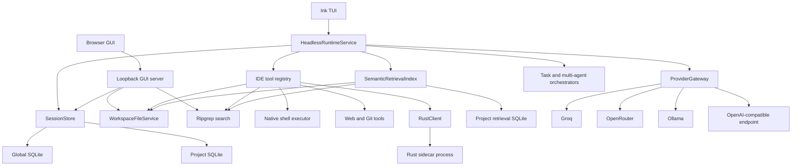
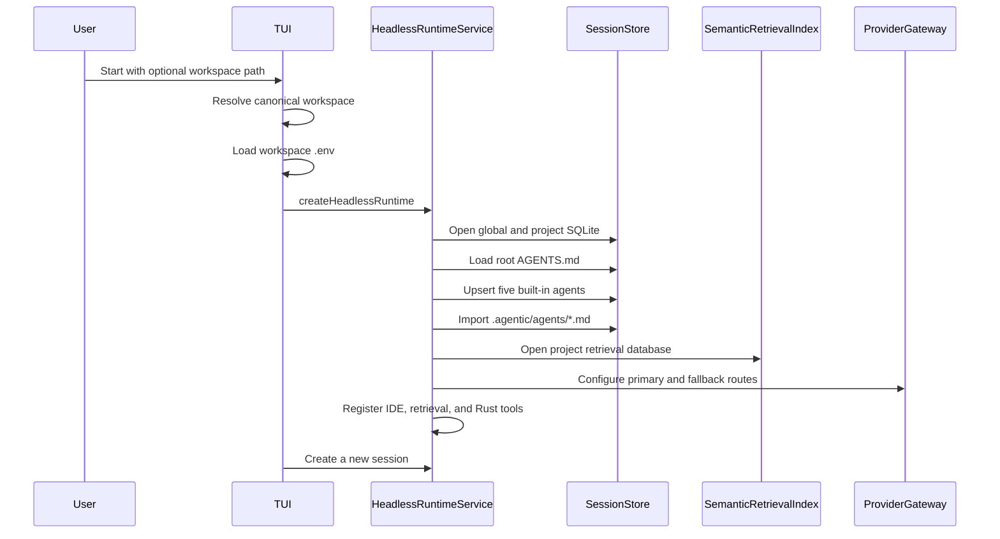
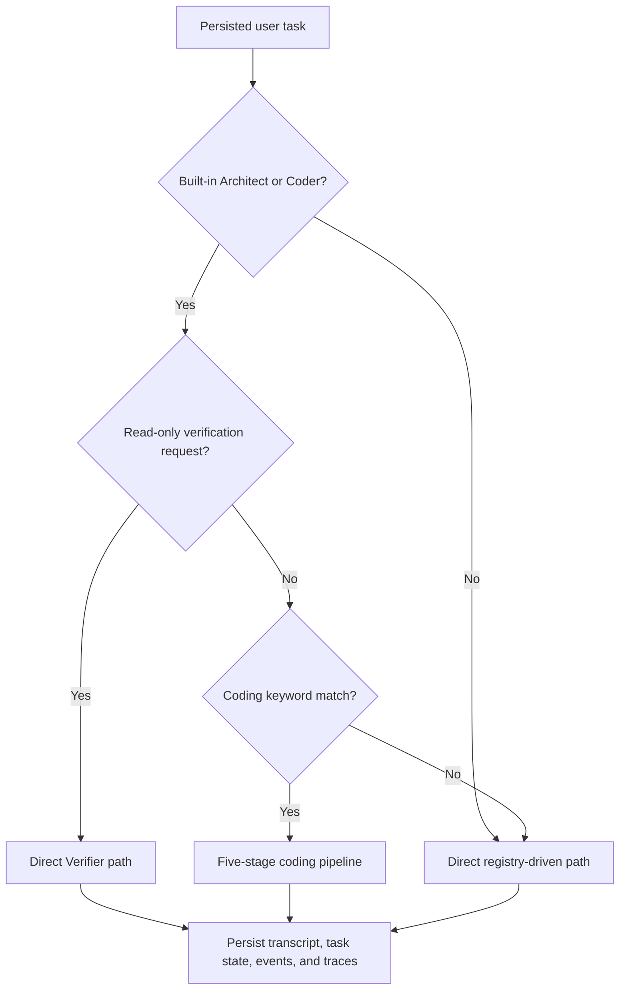
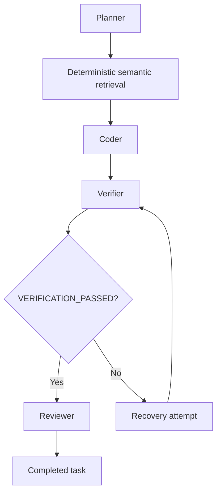
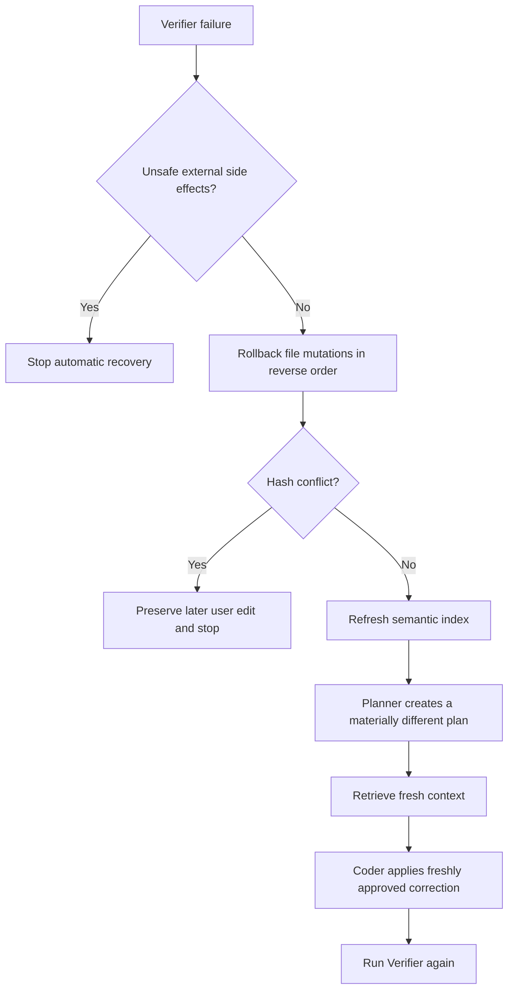

# Architecture and Implementation Status

## Document purpose

This document describes the architecture that exists in the current source tree.
It separates working behavior from target behavior and records known gaps without
papering over them.

The source code is the ground truth. Older planning documents still contain
parts of the original Tauri, FlatCPG, structural diff, Rust WAL, and routing
vision. Those parts are treated as plans unless the current runtime actually
calls them.

## System summary

The project is a TypeScript-first agentic coding runtime with a small Rust
sidecar. The TypeScript packages own orchestration, model routing, persistence,
retrieval, tools, approvals, recovery policy, and client-facing services. The
Rust process handles selected syntax and diff operations through a typed JSON
RPC boundary.

The only complete interactive runtime client today is the Ink TUI. The browser
GUI is a read-only workbench and provider settings client. It is not connected
to task execution yet.

The main coding path is a sequential five-stage pipeline:

1. Planner
2. Deterministic semantic retriever
3. Coder
4. Verifier
5. Reviewer

Read-only requests to run tests, builds, lint, type checks, syntax checks, or
format checks take a shorter path directly to the Verifier. Other conversational
and custom-agent requests use the registry-driven multi-agent path.

## Top-level architecture



### Runtime ownership

`HeadlessRuntimeService` is the application boundary. It owns:

- Session and task lifecycle
- Built-in and project agent registration
- Provider and model composition
- Tool registry composition
- Task routing
- Task cancellation
- Approval requests
- Runtime event delivery
- Pipeline checkpointing
- Recovery state
- Manual context
- Isolated questions
- Event and trace persistence

The TUI consumes this service. Browser code does not import Node-only packages.
A future IDE transport should expose this same service rather than reimplementing
runtime behavior in the GUI.

## Startup flow



### Detailed startup steps

1. `packages/tui/src/index.tsx` resolves the workspace argument.
2. It loads `.env` from the workspace unless `ENV_FILE` points elsewhere.
3. `packages/tui/src/app.tsx` converts environment variables into a primary
   provider/model route and optional fallbacks.
4. `createHeadlessRuntime()` opens `SessionStore` for the canonical project root.
5. `SessionStore` opens one global SQLite database and one project SQLite
   database.
6. The runtime loads the root `AGENTS.md` file as project instructions.
7. The runtime upserts the built-in Architect, Retriever, Coder, Verifier, and
   Reviewer definitions.
8. Project agent definitions from `.agentic/agents/*.md` are imported into the
   global agent registry, except for reserved built-in IDs.
9. The runtime opens a project-specific semantic retrieval database beside the
   project session database.
10. The runtime creates one provider gateway and one model resolver.
11. The runtime creates complete tool registries on demand and scopes them per
    agent.
12. The TUI creates a new session.

The TUI does not automatically reopen the latest session. Persistence supports
saved sessions, but current presentation code starts a new one each time.

## Task routing

Task routing happens inside `HeadlessRuntimeService.executeTask()`.



Routing precedence matters:

1. Verification-only routing is checked first.
2. Coding-pipeline routing is checked second.
3. Everything else uses direct registry-driven execution.

### Verification-only routing

A request routes directly to the Verifier when all of the following are true:

- The selected agent is the built-in Architect or Coder.
- The request asks to run, execute, rerun, check, or verify tests, a suite, a
  build, lint, type checking, syntax checking, or format checking.
- The request either explicitly forbids mutation or does not contain an
  implementation-oriented mutation keyword.

Examples that take this path:

- "Run the tests without modifying files."
- "Check the build and lint results."
- "Verify the typecheck only."

The Verifier receives:

- Its own verifier system prompt
- Root project instructions loaded from `AGENTS.md`
- Prior session history
- Manual session and task context
- The current user request
- Only verifier-scoped tools

Handoffs and coding workflow continuation are disabled for this path. This
prevents a read-only check request from entering Planner, Retriever, Coder, and
Reviewer stages merely because words such as `build` or `test` also appear in
the broader coding heuristic.

### Coding-pipeline routing

After verification-only routing is ruled out, prompts from the built-in
Architect or Coder enter the fixed pipeline when they contain a coding keyword
such as:

- add
- build
- change
- create
- debug
- delete
- edit
- fix
- implement
- migrate
- modify
- patch
- refactor
- remove
- rename
- test
- update
- write

This is a regular-expression heuristic, not a semantic classifier. Ambiguous
prompts can still take the wrong path.

### Direct registry-driven routing

The direct path handles:

- Conversation
- Read-only questions that are not verification commands
- Research
- Custom agents
- Explicitly selected non-built-in agents
- Requests that do not match the coding heuristic

The direct path creates a `MultiAgentOrchestrator`, resolves the selected agent,
scopes its tools, and runs `AgentRunner`. If handoffs are enabled, the agent can
use `handoff_agent` to invoke another registered agent.

## Five-stage coding pipeline



### 1. Planner

The Planner uses the built-in `general` agent definition, named Architect in the
prompt. It receives the original objective, prior session history, project
context, and earlier stage results when relevant.

Its job is to produce a small, testable plan. It has read-only tools and cannot
mutate the workspace.

### 2. Retriever

The pipeline Retriever is deterministic. It is not an LLM call and does not use
the registered Retriever agent definition.

It queries the semantic retrieval index using:

- The original objective
- The Planner output

The live pipeline requests up to ten slices with a maximum of forty lines per
slice.

### 3. Coder

The Coder receives:

- The objective
- The current project and manual context
- Planner output
- Retrieval output
- Other completed stage summaries

It has workspace mutation tools, read-only Git inspection, shell tools, semantic
retrieval, and Rust analysis tools. Mutations and shell-backed tools still pass
through approval.

### 4. Verifier

The Verifier receives project instructions as part of its system prompt. It is
expected to:

- Run syntax or compile checks
- Run relevant tests
- Inspect the Git diff
- Report exact commands and failures
- End with `VERIFICATION_PASSED` only when checks pass

The runtime treats verification as passed only when the final text ends with an
exact `VERIFICATION_PASSED` marker on its own line.

### 5. Reviewer

The Reviewer receives the plan, retrieval evidence, implementation result, and
verification result. It is read-only and produces the final user-facing summary.
It does not run commands or modify files.

### Pipeline execution rules

The live pipeline is intentionally sequential. This avoids multiple agents
editing the same working tree at once.

Current limits are:

- Two attempts per stage
- Ten stage attempts in total
- Thirty-two model requests per task
- Ten minutes per runtime execution or resume invocation
- One hundred twenty-eight tool calls per multi-agent run

Completed stages are checkpointed in project SQLite. `resumeTask()` reloads the
checkpoint and skips completed stages.

The model-request count survives resume. The ten-minute wall-clock window starts
again for each resume invocation, so it is not a cumulative task lifetime
budget.

## Registry-driven multi-agent behavior

`MultiAgentOrchestrator` is the general agent execution boundary. It does not
hardcode roles.

An `AgentDefinition` contains:

- Stable ID
- Name and description
- System prompt
- Capability labels
- Optional allowed tool list
- Optional delegation target
- Optional model-step limit
- Enabled state

The orchestrator:

1. Loads an agent by ID.
2. Resolves its model.
3. Resolves the full tool registry.
4. Enforces `allowedTools` in code.
5. Adds `handoff_agent` when handoffs are enabled.
6. Runs the generic model and tool loop.
7. Returns a child handoff result to the parent as a tool result.

Handoffs are nested and sequential. They are bounded by:

- Maximum depth
- Maximum total handoffs
- Maximum handoffs per source and target pair
- Duplicate active handoff detection
- Shared model-request budget
- Shared duration budget
- Cancellation

The resolver interface allows different models per agent, but the default
runtime composition returns the same provider gateway for every agent. Per-role
model selection is not implemented yet.

## AgentRunner model and tool loop

`AgentRunner` is provider-neutral. It owns one model/tool conversation, not an
agent identity.

For each step it:

1. Estimates the provider-visible request size.
2. Compacts context if needed.
3. Calls the selected `LanguageModel`.
4. Appends the assistant message.
5. Validates every tool call with Ajv.
6. Prepares an approval preview when required.
7. Requests approval before side effects.
8. Executes approved tools.
9. Returns structured tool results to the model.
10. Continues until a final answer or a safety stop.

### Loop protection

The runner caches tool calls by tool name, arguments, and workspace revision.
An identical call against an unchanged workspace reuses a concise skip result
rather than repeating the operation and copying a large result into context.

After four duplicate cached calls, the run stops with a visible safety message.
There is also a per-agent step limit and a shared multi-agent model-request
limit.

### Workflow continuation

For explicit coding requests, the runner can require follow-through stages such
as mutation, reread, and verification. If a model stops after an intermediate
read or edit, the runner can add a focused continuation message.

This continuation is disabled for verification-only routing and other paths
where mutation follow-through is not appropriate.

## Provider architecture

### Provider-neutral boundary

`LanguageModel` exposes:

- `respond(request)`
- Optional context estimation

Responses can include:

- Assistant text
- Structured tool calls
- Token usage
- Timing
- Provider and model IDs
- Cost when known
- Response metadata

### Runtime providers

The gateway registers:

| Provider          | Protocol               | Credential behavior                        |
| ----------------- | ---------------------- | ------------------------------------------ |
| Groq              | OpenAI-compatible chat | Stored key, then environment fallback      |
| OpenRouter        | OpenAI-compatible chat | Stored key, then environment fallback      |
| Ollama            | `/api/chat`            | Local endpoint, no key required by default |
| OpenAI-compatible | OpenAI-compatible chat | Configurable URL and optional key          |

`@agentic-runtime/openai` also contains an OpenAI Responses adapter, but the
default runtime gateway does not register a provider named `openai`.

### Route construction

The TUI builds a primary route from `MODEL_PROVIDER` and matching model settings.
Configured model variables can add fallbacks. Saved provider settings override
route model IDs and base URLs.

Credentials resolve in this order:

1. Global SQLite provider credential
2. Provider-specific environment variable fallback

The default runtime registers selected routes manually rather than requiring
provider model discovery at startup.

### Ranking

The gateway ranks routes using:

1. Tool support
2. Estimated context fit
3. Cooldown state
4. Explicit preference order
5. Estimated cost
6. Context-window size
7. Stable provider and model ordering

Preference is considered before cost. Current behavior is best described as
ordered routing with eligibility checks and cost-aware tie breaking, not a full
cost optimizer.

### Failover

Retryable failures include:

- Rate limits
- Context-length errors
- Timeouts
- Connection errors
- Transient server errors

The gateway can try the next ranked route without rebuilding the request. The
same message and tool state is preserved. Retryable transient failures place a
route on cooldown. Authentication and invalid-request failures stop immediately.

Routing events include:

- Provider and model
- Attempt number
- Human-readable reason
- Estimated context tokens
- Estimated cost when available
- Failure classification

The TUI displays recent route and failover activity.

### Provider limitations

- There is no task-complexity signal.
- There is no per-agent model policy.
- Tokens already used by the task do not affect route choice.
- There is no task cost governor.
- The problem statement's `$0.50` ceiling is not enforced.
- The model parameter catalog has only two known entries.
- Unknown model sizes are marked `unverified` but remain usable.
- Runtime-created manual routes generally have unknown parameter counts.
- The clients do not display `unverified` status.
- There is no Ollama RAM or VRAM fit check.
- `OLLAMA_TIMEOUT_MS` is not wired through default gateway composition.
- Gateway-created Ollama requests currently use the adapter's 300-second
  default timeout.
- Model responses are not streamed token by token in current clients.

## Retrieval architecture

### Project isolation

Every canonical project root receives a distinct project ID. Retrieval records
include that project ID, so two projects cannot see each other's files, symbols,
or edges even when a database path is shared in tests.

The default runtime stores `retrieval.db` beside the project's session database.

### Index contents

The retrieval database contains:

- Project records
- File hashes and metadata
- Symbols and line spans
- Definition, reference, call, import, and export edges

For TypeScript-family files, extraction uses the TypeScript compiler API.
Supported structural extraction includes:

- Declarations
- Exported symbols
- Imports and exports
- Identifier references
- Calls
- Relative module edges
- Compact signatures

For other text languages, a lightweight regex extractor records common
definitions and imports. Ripgrep supplies path and text fallback.

### Incremental indexing

Before indexing a file, retrieval compares the current workspace hash with the
stored hash. Unchanged files are reused. Changed files are replaced
transactionally. Deleted files are removed from the index.

Generated, dependency, database, archive, binary, and common build paths are
ignored.

### Query and ranking

Candidate ranking combines:

- Exact symbol match
- Partial symbol match
- Exported definition weight
- Definition, call, import, export, and reference edge weight
- File-path match
- Ripgrep text match
- One-hop graph neighbors
- Recent file modification

Results are compact file and line slices. The retrieval API does not normally
return entire files.

### Poor-result recovery

If the exact query returns no candidates, retrieval splits the query into
identifier and prompt terms and retries. If a query produces excessive
candidates, results are ranked and limited per file.

The response records whether retrieval was broadened, narrowed, or remained
empty.

### Retrieval limitations

- The TypeScript index is syntactic rather than fully type-checked.
- There is no full control-flow or data-flow graph.
- There is no LSP diagnostic integration.
- Failing-test locations are not explicit ranking signals.
- Mixed-language semantics are limited to regex metadata and text search.
- Graph expansion is shallow.
- There is no background file watcher.
- Queries re-run an incremental project scan by default.
- The Rust FlatCPG and PageRank code are not connected to this index.

## Context compaction

Compaction runs inside `AgentRunner` before model requests and after provider
context-length failures.

### Trigger and targets

Default behavior:

- Trigger at 75 percent of usable context
- Compact toward 60 percent for normal threshold compaction
- Compact toward 45 percent after a context-limit error
- Keep at least two recent exchanges
- Allow up to four compaction passes
- Allow up to two context-limit recovery attempts
- Use an 8,192-token fallback window when the model has no known window
- Reserve 1,024 output tokens by default

### Compaction stages

1. Find `read_file` tool results.
2. Ask the Rust sidecar to prune supported source files to signatures.
3. Group assistant tool calls with their tool results.
4. Select old exchanges while retaining recent and current user exchanges.
5. Build a structured compact task state.
6. Replace removed history with a compaction system message.
7. Repeat if the request still exceeds the target.

The structured state retains bounded forms of:

- Current objective
- Plans
- Completed work
- Failures and rejected hunks
- Changed files and hashes
- Verification status
- Retrieved slices
- Project rules and system instructions
- Open questions

Compaction checkpoints are emitted as events and stored as task context and task
state by the headless runtime.

### Compaction limitations

- Token estimation falls back to roughly four characters per token.
- Structured extraction uses heuristics over message text.
- The runtime does not use a dedicated summarization model.
- Unsupported languages cannot use Rust signature pruning.
- Persisted compaction state supports restart context, but direct agent runs do
  not resume an exact in-flight model/tool turn.

## Tool architecture

### Tool registry

All tools implement provider-neutral core contracts. Each tool declares:

- Name
- Description
- JSON Schema arguments
- Approval policy
- Optional preview function
- Execute function

Ajv validates model-generated arguments before approval or execution. Hidden
tools can remain callable as delegation proxies without being advertised to the
model.

### Workspace tools

Implemented workspace tools:

- `list_directory`
- `read_file`
- `write_file`
- `create_file`
- `delete_file`
- `apply_patch`
- `find_files`
- `search_text`

Workspace paths are resolved against one root. Paths outside the root and
symlink traversal are rejected. Reads are UTF-8 text only and bounded by size.
Writes are atomic and conflict checked.

### Command tools

Implemented shell-backed tools:

- `run_command`
- `compile_code`
- `run_code`
- `format_code`
- `syntax_check`

Windows uses `cmd.exe`. Linux and macOS use `/bin/sh` unless configured
otherwise. Commands have timeout and output bounds, receive a restricted
environment, and inherit the runtime abort signal.

### Web tools

Implemented web tools:

- `browse_url`
- `crawl_site`

Web requests:

- Accept only HTTP and HTTPS
- Reject private and reserved network targets
- Do not execute page scripts
- Limit response size
- Bound redirects
- Bound crawl pages and concurrency
- Restrict crawling to the same domain

### Git tools

Read-only Git tools:

- `git_status`
- `git_diff`
- `git_log`
- `git_branches`

Approval-gated Git tools:

- `git_add`
- `git_commit`
- `git_checkout`
- `git_push`

Generated dependency and build directories are blocked from Git staging by the
specialized tool checks.

There is no Git merge tool. Built-in Coder permissions currently expose only
read-only Git inspection, so Git mutations require an appropriately configured
custom agent.

## Human-in-the-loop review

### Approval policy

Auto-approved operations include most local read-only workspace, search,
retrieval, Rust analysis, and Git inspection tools.

Approval-gated operations include:

- File mutations
- Shell commands
- Compile, run, format, and syntax commands
- Git mutations
- Web browsing and crawling

Web reads are approval-gated as a conservative network policy even though they
do not mutate the local workspace.

### File diff preparation

Before a file mutation, `WorkspaceFileService` creates:

- Workspace-relative path
- Base SHA-256 hash
- Proposed hash
- Unified text diff
- Stable line hunk IDs
- Original and replacement text for each hunk

Stable hunk IDs include path, line range, and content hashes.

### Partial approval

The TUI supports:

- Hunk navigation
- Per-hunk accept or reject toggles
- Apply selected hunks
- Accept all
- Reject all

Before applying approved hunks, the workspace service:

1. Rereads the file.
2. Verifies the base hash.
3. Rebuilds the proposal.
4. Verifies the approved preview still matches.
5. Applies accepted non-overlapping hunks.
6. Writes atomically.
7. Returns rejected hunks to the model.

A stale base fails closed. A partial approval does not silently apply rejected
content.

### HITL limitations

- The browser GUI has no approval transport or diff review.
- The GUI editor is read-only.
- The Rust diff engine is advisory and is not the source of approval hunks.
- TypeScript `diffLines` currently produces the authoritative file hunks.

## Persistence

### Global database

The global database stores:

- General settings
- Provider credentials
- Provider base URLs and model IDs
- Last provider validation result
- Agent definitions

Provider credentials are stored in plaintext. The database file is the current
secret boundary.

### Project database

The project database stores:

- Canonical project identity
- Sessions and transcripts
- Tasks and serialized task state
- Runtime events
- Manual and generated context items
- Orchestration checkpoints
- Recovery state
- Trace spans

All queries are scoped to the current project ID.

### Default data paths

On Windows:

```text
%LOCALAPPDATA%/agentic-runtime/global.db
%LOCALAPPDATA%/agentic-runtime/projects/<project-id>/project.db
%LOCALAPPDATA%/agentic-runtime/projects/<project-id>/retrieval.db
```

On Linux and macOS, the root defaults under `XDG_DATA_HOME` or
`~/.local/share/agentic-runtime`.

### SQLite journaling

SQLite databases use SQLite WAL journal mode. This provides normal SQLite
crash safety and is separate from the Rust memory-mapped `Wal` type.

### Resume behavior

Implemented resume behavior:

- Pipeline checkpoints are stored before and after stage work.
- Completed stages are skipped after restart.
- Stage attempts and failure fingerprints are persisted.
- The task-wide model-request count is persisted.
- Pending recovery state can be persisted.
- Paused model work restarts from the durable stage boundary.

Not implemented:

- Resuming an arbitrary shell process in place
- Resuming a provider HTTP request in place
- Exact durable checkpoints for every direct-path model and tool turn
- TUI task discovery and `/resume`
- Automatic reopening of the last session

## Recovery

### Intended verifier recovery flow



The runtime contains this recovery state machine. `WorkspaceFileService` also
contains real mutation preimages and hash-guarded rollback primitives.

### Disconnected default mutation journaling

The default file tools currently do not return the workspace mutation record in
`ToolResult.workspaceMutation`.

`WorkspaceFileService` creates a valid `mutation` record, but
`packages/tools/src/index.ts` returns changed status, review information, and
changed file hashes without forwarding that record.

`HeadlessRuntimeService` only journals mutations when a completed tool result
contains `workspaceMutation`. Therefore the default tools do not populate the
runtime recovery journal.

Current consequence:

- Recovery can detect verification failure.
- Recovery can persist its phase.
- Recovery can reindex, replan, retrieve, and recode.
- Recovery normally has no default file mutation records to roll back first.
- The documented end-to-end hash-guarded rollback behavior is not complete.

This is a core correctness issue and is higher priority than GUI work.

### External side effects

The runtime marks successful `coding-agent` calls to selected command and Git
mutation tools as untracked side effects. If such a side effect is recorded,
automatic rollback stops rather than guessing.

Limitations:

- Arbitrary command, Git, package-manager, network, and child-process effects
  cannot be safely reversed.
- Side-effect tracking is currently focused on the Coder.
- Verifier commands can potentially alter state but are not recorded as
  untracked recovery side effects.
- Direct-path custom agents have no workspace recovery journal equivalent.

## Tracing and observability

### Trace schema

The `trace_spans` table supports:

- Project, session, task, trace, and span IDs
- Parent span ID
- Span kind and name
- Status
- Serialized input and output
- Context artifacts
- Usage
- Cost
- Start, end, and duration
- Provider, model, agent, stage, and tool identifiers
- Error text

Secrets and sensitive field names are redacted before trace persistence.

### Spans currently created

The runtime currently creates useful spans for:

- Tasks
- Pipeline stages
- Agents
- Provider attempts
- Context compaction
- Isolated questions

Routing, task, pipeline, approval, agent, and tool events are also stored in the
project event log.

### Incomplete AgentRunner trace correlation

The event types allow correlation fields, but `AgentRunner` does not currently
populate them:

- `model_request` does not include a stable `callId` or the complete request.
- `model_response` does not include the matching `callId` or complete response.
- `tool_requested` does not include `spanId` and `parentSpanId`.
- `tool_completed` does not include matching span IDs.

The runtime tracing code expects those fields before it creates model and tool
spans.

Current consequence:

- Model-call spans are not created through the intended path.
- Tool spans are not created through the intended path.
- Provider-attempt spans often attach above the missing model-call level.
- Exact model inputs and outputs are not available as correlated model spans.
- Per-model usage and timing are not reliably captured in the hierarchy.
- The stored hierarchy is useful but incomplete.

`AgentRunner.toToolMessage()` also does not copy `ToolResult.contextArtifacts`
into tool-message metadata, which weakens context-artifact reconstruction.

This is another core correctness issue and must be fixed before building a GUI
dashboard on top of the trace API.

### Dashboard status

There is no live or historical observability dashboard. The headless runtime has
`listTraceSpans(taskId)`, but neither current client provides a complete trace
viewer.

A future dashboard should display safe progress summaries, tool rationale, and
recorded inputs and outputs. It should not expose private chain-of-thought.

## Rust sidecar

### Process boundary

`RustClient` lazily starts the Cargo-built executable and communicates through
newline-delimited JSON on stdin and stdout.

The bridge provides:

- Request IDs
- Typed client methods
- Per-request timeout
- Child spawn error handling
- Child exit handling
- Pending request rejection

`pnpm build` compiles the Rust crate before TypeScript so the expected debug
binary exists for local runtime use.

### Reachable methods

| RPC method     | Current behavior                        | Runtime use                   |
| -------------- | --------------------------------------- | ----------------------------- |
| `slice_ast`    | Extract named syntax blocks             | `analyze_code_structure` tool |
| `prune_ast`    | Replace function bodies with signatures | Context compaction            |
| `compute_diff` | Produce line-based LCS chunks           | `compute_ast_diff` tool       |
| `check_cycle`  | Compare supplied BLAKE3 snapshots       | Bridge test only              |

Tree-sitter support currently covers TypeScript/JavaScript, Python, and Rust.
Other languages use a lightweight declaration and indentation fallback for
slicing.

### Rust code that is not integrated

- `FlatCPG` exists but is not populated from the workspace.
- `FlatCPG.compute_ppr_slice()` is not called by retrieval.
- The RPC slicer walks syntax trees directly.
- The diff engine is line-based LCS, not an AST edit-distance engine.
- There is no three-way AST merge.
- TypeScript HITL approval does not use Rust diff chunks.
- Runtime orchestration does not call `check_cycle`.
- The cycle request does not represent a complete workspace Merkle tree.
- The memory-mapped Rust `Wal` is not instantiated by the server or runtime.
- The Rust WAL starts at offset zero and does not support durable replay.
- The global Rust client is not explicitly stopped when the runtime closes.

The current sidecar is useful for syntax slicing, signature pruning, and an
advisory line diff. The larger Rust systems design remains planned.

## Clients

### TUI

The Ink TUI is the current runtime client.

Implemented capabilities:

- Workspace selection
- Provider and model selection from environment and stored settings
- New session creation
- Runtime task execution
- Route and failover activity
- Pipeline and agent activity
- Tool cards
- Approval prompts
- Per-hunk partial approval
- Cancellation
- Manual file and line context
- Isolated `/bytheway`
- Session and agent listing
- Agent selection
- Provider settings and validation

Current commands:

- `/help`
- `/new`
- `/clear`
- `/sessions`
- `/agents`
- `/agent [id]`
- `/settings`
- `/context`
- `/context add <file>[:line|start-end]`
- `/context remove <file>[:line|start-end]`
- `/bytheway <question>`
- `/exit`

Current TUI limitations:

- No `/resume`
- No task list
- No `/trace`
- No current agent CRUD commands
- No model picker command
- No clickable file or line references
- No token and cost summary
- No token-by-token model streaming
- Only the latest eight transcript messages are rendered

### Manual context

Manual context stores session-scoped snapshots of a complete file or selected
inclusive line range. It does not remain linked to future file changes.

A character budget limits selected context. Manual context is included in direct,
verification-only, and pipeline task context.

### Isolated questions

`/bytheway` uses one model call with:

- No prior transcript
- No manual task context
- No tools
- No handoffs
- No durable main-transcript mutation

After the isolated result, the original session history remains unchanged.

### GUI server

The GUI server binds to `127.0.0.1` and uses only `node:http`.

Implemented endpoints:

- `GET /api/project`
- `GET /api/files`
- `GET /api/files/content`
- `GET /api/search`
- `GET /api/providers`
- `PUT /api/providers/:id`
- `DELETE /api/providers/:id`
- `POST /api/providers/:id/validate`

It also serves the built Vite application.

The server uses the same global provider records as the TUI. API keys are
returned to the browser only as masked status, although the stored values remain
plaintext in SQLite.

The GUI server does not construct `HeadlessRuntimeService` and has no task or
event transport.

### Browser GUI

Implemented browser features:

- Activity bar
- Explorer
- Workspace directory browsing
- Workspace file reads
- Read-only Monaco editor
- Language workers
- Cursor and language status
- Provider settings
- Real provider validation
- Local-only chat preview

Not implemented in the browser:

- Runtime chat
- Task start, cancellation, or resume
- Agent selection
- Approvals
- Diff review
- File save
- Manual context controls
- `/bytheway`
- Clickable file and line references
- Routing activity
- Trace dashboard
- Live runtime events

## Package boundaries

| Package      | Responsibility                                                                | Key dependencies                        |
| ------------ | ----------------------------------------------------------------------------- | --------------------------------------- |
| `core`       | Provider-neutral contracts, runner, orchestrators, tool registry, Rust bridge | Ajv                                     |
| `openai`     | OpenAI Responses and compatible chat adapters                                 | Core, OpenAI SDK                        |
| `ollama`     | Ollama chat adapter and tool fallback parsing                                 | Core                                    |
| `gateway`    | Providers, model registry, routing, failover, credentials                     | Core, OpenAI, Ollama                    |
| `command`    | Cross-platform bounded shell execution                                        | Core, Execa                             |
| `search`     | Ripgrep-backed file and text search                                           | Ripgrep, Execa                          |
| `workspace`  | Workspace-safe reads, writes, hashes, hunks, rollback primitives              | Diff                                    |
| `retrieval`  | Persistent semantic index and compact ranked slices                           | Search, workspace, TypeScript           |
| `tools`      | Concrete workspace, shell, web, crawl, and Git tools                          | Core services and established libraries |
| `session`    | Global and project SQLite persistence                                         | Core, gray-matter                       |
| `runtime`    | Application composition and lifecycle                                         | Core services and persistence           |
| `tui`        | Ink presentation and approval adapter                                         | Runtime, gateway types, React/Ink       |
| `gui-server` | Loopback settings and read-only workspace HTTP API                            | Gateway, session, search, workspace     |
| `gui`        | Browser workbench shell                                                       | Monaco, Vite                            |
| `rust`       | Syntax slicing, signature pruning, line diff, cycle primitive                 | Tree-sitter, BLAKE3, memmap2            |

The dependency direction points toward provider-neutral core contracts. The
browser depends on DTOs over HTTP rather than Node implementation packages.

`packages/server` is not an active source package. It contains generated output
only and has no package manifest or source boundary.

## Key tradeoffs

### TypeScript orchestration with a Rust sidecar

Selected approach:

- Keep policy, composition, and package boundaries in TypeScript.
- Use Rust only through a process boundary for selected expensive operations.

Why:

- TypeScript is faster to iterate across providers, tools, persistence, and UI.
- Process isolation keeps native failures away from the main runtime.
- The Rust boundary can evolve without forcing native bindings into every
  package.

Cost:

- JSON serialization is not zero-copy.
- The sidecar is not currently integrated deeply enough to justify all claims in
  the original design.
- Child lifecycle management needs more work.

### Sequential mutation pipeline

Selected approach:

- Run Planner, Retriever, Coder, Verifier, and Reviewer sequentially.

Why:

- Multiple small agents editing one working tree concurrently are difficult to
  recover safely.
- Sequential checkpoints are easier to inspect and resume.
- Verification sees a stable post-edit state.

Cost:

- Independent read-only work is not parallelized.
- End-to-end latency is higher than an optimized parallel scheduler.

### SQLite persistence

Selected approach:

- Separate global settings from project task state.
- Use one additional SQLite database for retrieval.

Why:

- SQLite is local, inspectable, transactional, and dependency-light.
- Project isolation is explicit.
- Long-running state survives client and process restarts.

Cost:

- Credentials are not encrypted.
- Schema evolution is manual.
- Three local database files must remain consistent at the application level.

### Compiler structure plus ripgrep retrieval

Selected approach:

- Use TypeScript compiler syntax structure for TypeScript.
- Use ripgrep and lightweight text extraction for other languages.

Why:

- It provides real symbol and graph signals without a heavy vector database.
- It is deterministic and cheap enough for local use.
- Ripgrep keeps mixed-language repositories usable.

Cost:

- Cross-language semantic quality is uneven.
- It is not a complete code property graph.
- There is no embedding-based semantic fallback for conceptual queries.

### Explicit tools with JSON Schema

Selected approach:

- Use structured tool definitions and Ajv validation.

Why:

- Small models benefit from narrow, explicit operations.
- Approval decisions happen after validation.
- Specialized tools are easier to secure than unrestricted shell prompting.

Cost:

- Some local models still emit malformed or text-encoded calls.
- The Ollama fallback parser adds compatibility complexity.

### Stable line hunks before AST merge

Selected approach:

- Use base-hash-bound stable line hunks for current HITL review.

Why:

- It is testable and works across languages.
- It supports partial approval now.
- Stale files fail safely.

Cost:

- Hunks are textual rather than semantic.
- Partial acceptance can still produce code that needs verification.
- The Rust structural-diff target remains unimplemented.

### Core correctness before GUI

Selected approach:

- Complete recovery, event correlation, tracing, budgets, and transport contracts
  before connecting a rich GUI.

Why:

- A dashboard cannot repair missing trace data after the fact.
- A visual diff cannot make incomplete rollback safe.
- Duplicating unfinished runtime behavior in the GUI would increase drift.

Cost:

- The visible browser product trails the headless runtime.

### Tauri last

Selected approach:

- Keep the browser workbench and local server during runtime stabilization.
- Add a thin desktop wrapper only after the transport and workbench are complete.

Why:

- Tauri should package a stable application boundary, not become the place where
  orchestration is implemented.
- This avoids a second backend and keeps browser and desktop behavior aligned.

Cost:

- There is no desktop installer today.
- Cross-platform desktop behavior remains unverified.

## Current status by area

| Area                          | Status                | Notes                                                 |
| ----------------------------- | --------------------- | ----------------------------------------------------- |
| Provider-neutral core         | Implemented           | Contracts, runner, tools, and orchestrators exist     |
| Coding pipeline               | Implemented           | Sequential five-stage path with checkpoints           |
| Verification-only route       | Implemented           | Read-only checks route directly to Verifier           |
| Verifier project rules        | Implemented           | Root `AGENTS.md` is included in Verifier prompt       |
| Registry agents               | Implemented           | Custom agents and bounded handoffs exist              |
| Smart provider failover       | Implemented with gaps | Context, tools, cost estimate, preference, cooldown   |
| Model constraint enforcement  | Partial               | Sparse catalog and unverified models remain usable    |
| Semantic retrieval            | Implemented with gaps | Strong TypeScript path, shallow mixed-language path   |
| Context compaction            | Implemented           | Threshold, repeated passes, context-error recovery    |
| File HITL                     | Implemented in TUI    | Stable partial hunks and stale-base checks            |
| Persistence                   | Implemented           | Global, project, retrieval SQLite                     |
| Stage resume                  | Implemented           | Completed pipeline stages are skipped                 |
| Verifier rollback             | Incomplete            | Default mutation records are not forwarded to journal |
| Hierarchical tracing          | Incomplete            | Model and tool correlation fields are not emitted     |
| Rust syntax services          | Implemented           | Slicing, pruning, advisory line diff                  |
| Rust CPG, Merkle runtime, WAL | Planned               | Code fragments exist but are not integrated           |
| TUI runtime client            | Implemented           | Main usable client                                    |
| GUI settings and file viewer  | Implemented           | Read-only workbench                                   |
| GUI runtime client            | Not implemented       | No task, approval, event, or trace transport          |
| Tauri packaging               | Not implemented       | Intentionally last                                    |

## Current limitations

### Core correctness

- Default workspace mutation records do not reach the recovery journal.
- Model and tool trace spans lack AgentRunner correlation data.
- Context artifacts are not fully propagated through tool messages.
- Recovery cannot reverse arbitrary command, Git, network, or external effects.
- Verifier command side effects are not fully represented in recovery safety
  checks.
- Direct-path tasks have weaker durable checkpoints than pipeline tasks.

### Routing and budgets

- Task complexity is not a routing input.
- One gateway is shared across roles.
- Preference is stronger than cost in route order.
- Cumulative task tokens are not a route input.
- Task dollar cost is not bounded.
- Model parameter and local hardware compliance are incomplete.

### Retrieval

- No full control-flow or data-flow analysis.
- No LSP diagnostics or failing-test ranking.
- Limited mixed-language semantics.
- No background index watcher.

### Tools and HITL

- No Git merge tool.
- Built-in Coder cannot perform Git mutations.
- GUI has no approval or save path.
- Rust diff is not authoritative for applied changes.

### Persistence and security

- Credentials are plaintext at rest.
- TUI does not expose task resume.
- In-flight processes and HTTP requests restart from durable boundaries.

### Observability

- No complete model/tool call hierarchy.
- No GUI dashboard.
- No TUI trace command.
- Per-agent token and timing data are incomplete in persisted traces.

### Clients and delivery

- GUI chat is local-only.
- No IDE transport over the headless runtime.
- No clickable file and line references.
- No verified desktop packaging.
- Cross-platform clean-machine builds have not been documented and verified.

## Prioritized remaining-work plan

The order below puts core correctness before GUI work. Later phases assume the
earlier contracts and data are reliable.

### Priority 0: Fix default recovery journaling

Goal: make the documented verifier rollback path true for normal file tools.

1. Forward `WorkspaceFileService` mutation records as
   `ToolResult.workspaceMutation` from write, create, patch, partial write, and
   delete paths.
2. Preserve mutation records for no-op and partial-approval cases correctly.
3. Confirm delete and create rollback behavior.
4. Add an end-to-end runtime test where Coder changes a file, Verifier fails,
   recovery restores the preimage, Planner revises the plan, Coder receives
   fresh approval, and Verifier passes.
5. Add a conflict test where a user edits the file after the agent and rollback
   preserves the user's content.
6. Add a test proving external side effects stop automatic rollback.
7. Track unsafe side effects consistently across Coder, Verifier, and custom
   agents.

Exit condition:

- The default tool catalog populates the journal.
- Recovery tests exercise the real runtime and real workspace tools.
- Documentation no longer describes an untested path.

### Priority 1: Complete trace correlation and context propagation

Goal: produce a trustworthy trace before building any dashboard.

1. Generate a stable model call ID before each model request.
2. Emit the complete request without the abort signal.
3. Emit the matching response, duration, usage, provider, model, and cost.
4. Generate tool span IDs tied to the active model call.
5. Emit matching IDs on tool completion.
6. Copy `ToolResult.contextArtifacts` into tool-message metadata.
7. Attach provider-attempt spans beneath the correct model span.
8. Close failed and cancelled spans consistently.
9. Add redaction tests for nested credentials, headers, and tool arguments.
10. Add a persisted hierarchy test covering task, pipeline, agent, model,
    provider, tool, and compaction spans.
11. Verify exact sanitized input and output retrieval after reopening SQLite.

Exit condition:

- Every model and tool node has one stable parent.
- Usage and timing appear on the right model node.
- Context files and slices are reconstructable.

### Priority 2: Strengthen routing and hard budgets

Goal: meet provider and model constraints with visible, enforceable decisions.

1. Add task and stage complexity signals.
2. Add per-role route policies for Planner, Coder, Verifier, Reviewer, and
   isolated questions.
3. Include task tokens already used in route selection.
4. Track actual and estimated task cost.
5. Stop before the `$0.50` hard ceiling.
6. Expand the parameter catalog with cited total parameter counts.
7. Require explicit acknowledgement or block unknown parameter counts.
8. Surface model verification status in clients.
9. Add Ollama RAM and VRAM fit warnings.
10. Wire provider-specific timeouts, including `OLLAMA_TIMEOUT_MS`.
11. Test route changes by complexity, context, cost, cooldown, and task budget.
12. Write provider eligibility documentation.

Exit condition:

- Every route is explainable and policy-driven.
- A task cannot silently exceed model or cost constraints.

### Priority 3: Make long-horizon state consistently durable

Goal: reduce the gap between pipeline resume and direct-task resume.

1. Add task listing and resumable-task discovery to the runtime API.
2. Add finer direct-path checkpoints for model and tool turns.
3. Persist cumulative wall-clock and cost budgets across resume.
4. Preserve pending approvals and represent them safely after restart.
5. Define restart behavior for a task interrupted during a shell command.
6. Add TUI `/resume` and task listing.
7. Add restart tests at every durable pipeline boundary.

Exit condition:

- A client can discover and resume interrupted work without reconstructing IDs
  manually.
- Budget enforcement remains consistent across process restarts.

### Priority 4: Improve retrieval quality and efficiency

Goal: improve hard multi-file task accuracy without inflating context.

1. Add diagnostic and failing-test locations as ranking signals.
2. Add changed-file and recent-task relevance signals.
3. Evaluate deeper graph traversal against the current one-hop approach.
4. Add background or file-event-driven incremental indexing.
5. Avoid a full file discovery scan for every query when the index is known
   fresh.
6. Add semantic extraction for the most important non-TypeScript evaluation
   languages.
7. Build a retrieval benchmark with real multi-file tasks and relevance labels.
8. Measure slice precision, recall, token size, and query latency.
9. Decide with evidence whether embeddings or a fuller CPG add enough value.

Exit condition:

- Retrieval changes are justified by measured quality and token cost.

### Priority 5: Finish tool and HITL coverage

Goal: close problem-statement tool gaps while retaining fail-safe approval.

1. Add a specialized Git merge tool.
2. Decide whether built-in Coder should receive approval-gated Git mutation
   tools.
3. Add a search-engine tool if browsing known URLs is insufficient.
4. Improve command-side-effect classification.
5. Add explicit package-install policy and event labeling.
6. Add syntax validation after partial hunk approval when practical.
7. Add more cross-platform command and Git tests.

Exit condition:

- Required file, terminal, web, and Git operations are available through
  specialized approved tools.

### Priority 6: Align and harden the Rust sidecar

Goal: either integrate the native features or narrow the project claims.

1. Stop the Rust process during runtime shutdown.
2. Decide whether TypeScript or Rust owns authoritative diff hunks.
3. If Rust owns diffs, implement stable base-bound hunks and integrate them with
   approval tests.
4. Connect runtime cycle snapshots only if they improve stuck detection beyond
   current fingerprints and duplicate-call guards.
5. Populate FlatCPG from real project files before claiming CPG retrieval.
6. Benchmark PageRank slicing against the TypeScript retrieval index.
7. Implement durable WAL framing, recovery, and offsets before claiming Rust WAL
   resume.
8. Remove unused native concepts from public architecture if they do not earn
   their build and maintenance cost.

Exit condition:

- Every documented Rust feature has a runtime caller and an integration test, or
  it is clearly marked as experimental.

### Priority 7: Add a runtime transport

Goal: expose the stable headless service without copying its logic.

1. Define transport DTOs for sessions, tasks, agents, context, approvals,
   results, events, and traces.
2. Add HTTP endpoints for session and task lifecycle.
3. Add SSE or WebSocket delivery for runtime and trace events.
4. Add an approval-response endpoint with request correlation.
5. Add task cancellation and resume endpoints.
6. Add trace and historical event queries.
7. Keep the server loopback-only by default.
8. Add transport authentication or origin protection appropriate for a local
   privileged service.
9. Test disconnect, reconnect, duplicate approval, and stalled observer cases.

Exit condition:

- A non-Node client can run and observe tasks using only documented DTOs.

### Priority 8: Connect the browser workbench

Goal: turn the current read-only shell into a real IDE client.

1. Connect chat to runtime task APIs.
2. Add agent and model selection.
3. Show live route and pipeline activity.
4. Add cancellation and task resume.
5. Add approval prompts and per-hunk diff review.
6. Add an approval-gated editor save path.
7. Add manual context actions for files and selected editor lines.
8. Add `/bytheway` in the same chat surface.
9. Parse and render clickable file and line references in input and output.
10. Build one trace view that works for live and completed tasks.
11. Add drill-down for sanitized I/O, context, usage, cost, and timing.
12. Add browser integration tests for settings, chat, approval, partial hunks,
    context, and traces.

Exit condition:

- The GUI can complete a coding task without relying on the TUI.

### Priority 9: Security, documentation, and cross-platform delivery

Goal: make the system safe and reproducible for evaluation.

1. Move credentials to OS keychain-backed storage or encrypt them at rest.
2. Rewrite setup documentation around the actual provider and runtime flow.
3. Document Linux setup from a clean machine.
4. Verify Windows, macOS, and Linux builds.
5. Restore or remove stale example scripts and commands.
6. Keep architecture, implementation status, and checklists synchronized.
7. Document tool-call format and approval semantics.
8. Document measured tradeoffs and rejected alternatives.
9. Prepare the required source archive with Git history.
10. Prepare presentation material that the team can explain from source.

Exit condition:

- A new evaluator can install, configure, run, and understand the system without
  relying on undocumented local state.

### Priority 10: Package with Tauri last

Goal: add desktop distribution only after the runtime transport and GUI are
stable.

1. Resolve the current planning contradiction between no Tauri dependency and a
   future thin wrapper.
2. If a desktop wrapper is still desired, keep it transport-only.
3. Do not move orchestration, routing, persistence policy, or tool logic into
   Tauri commands.
4. Package the existing browser workbench and local runtime host.
5. Verify process startup, shutdown, workspace selection, and permissions on all
   target operating systems.
6. Produce signed or clearly documented evaluation builds as required.

Exit condition:

- Desktop packaging adds distribution, not a second runtime architecture.

## Definition of a complete first release

A defensible first release should meet all of these conditions:

- Verification-only requests remain read-only and use project instructions.
- Default file mutations are journaled and verifier recovery is proven end to
  end.
- Model and tool trace correlation is complete.
- Route decisions enforce model and task cost constraints.
- Pipeline and direct tasks have documented durable boundaries.
- Retrieval quality is measured on realistic multi-file tasks.
- All required tool categories are available with approval gates.
- The GUI uses the headless runtime transport and can complete a full task.
- Live and historical traces use the same data and view.
- Credentials are protected appropriately.
- Cross-platform setup and builds are verified.
- Tauri, if used, is only the final packaging layer.
