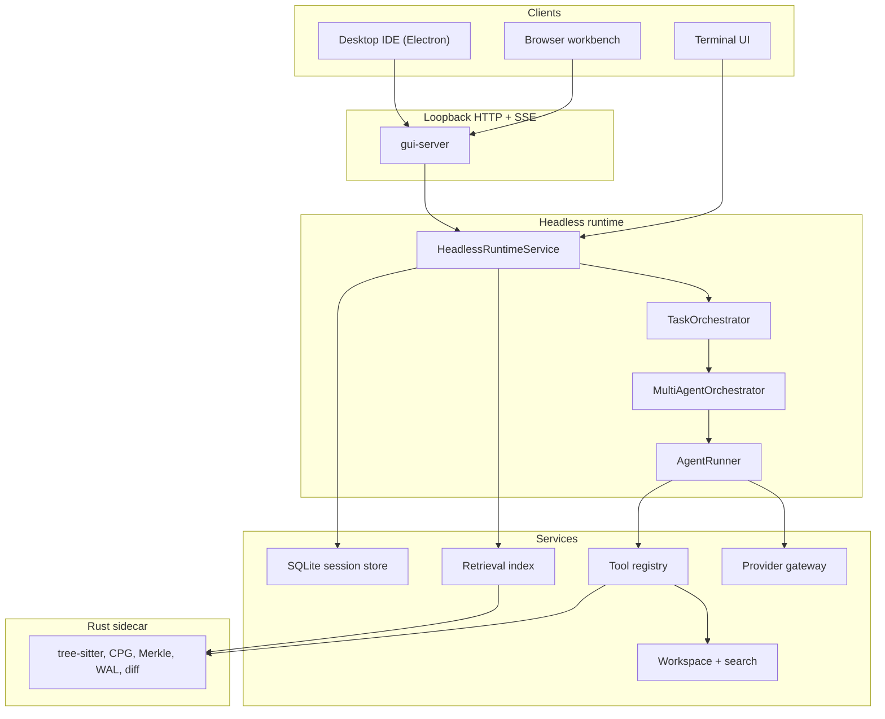
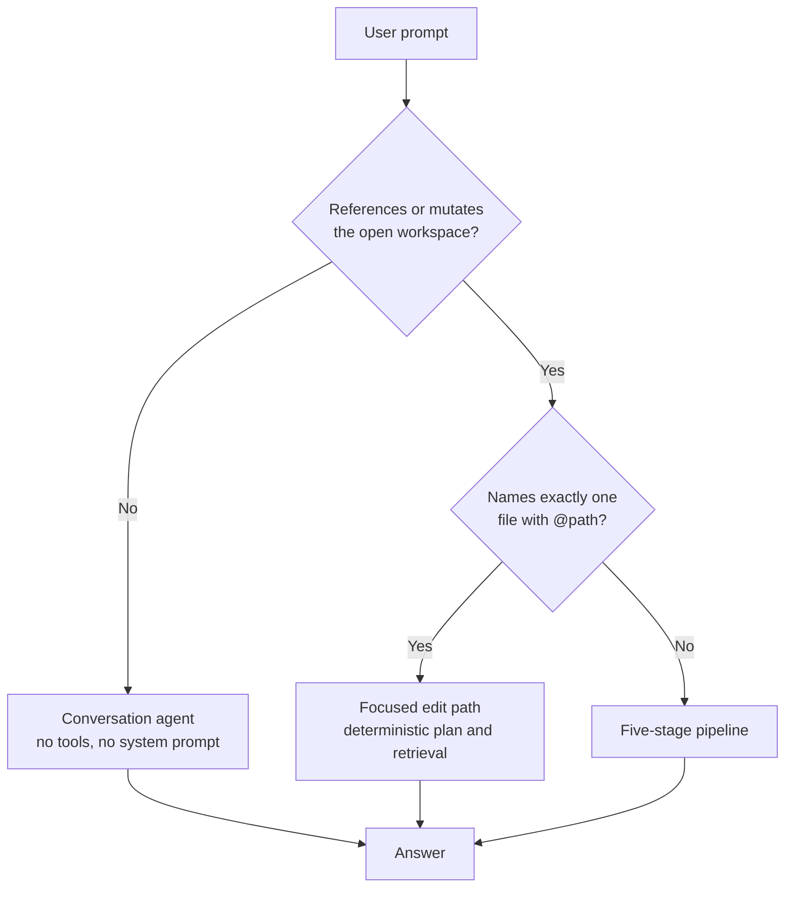
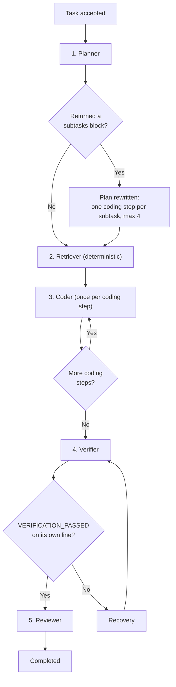
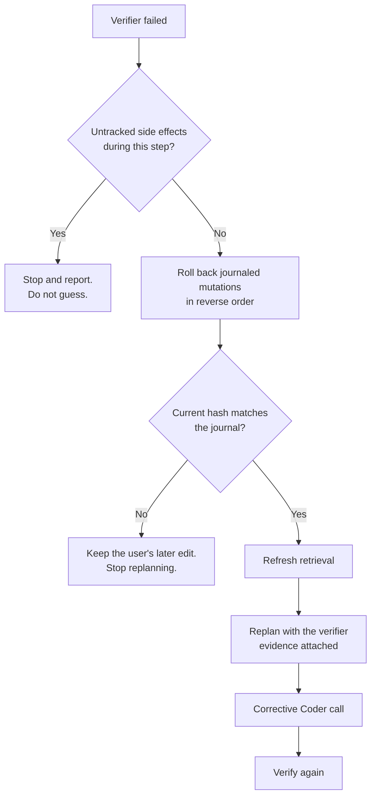
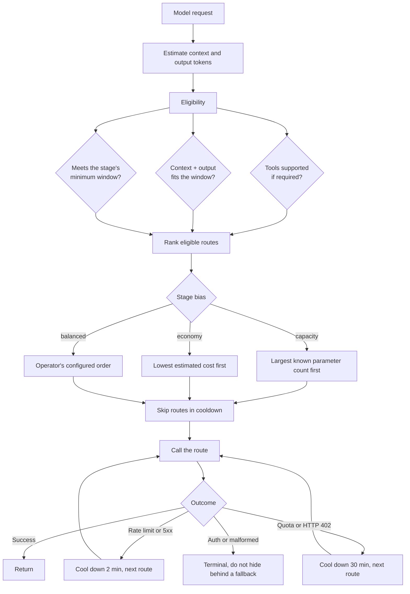
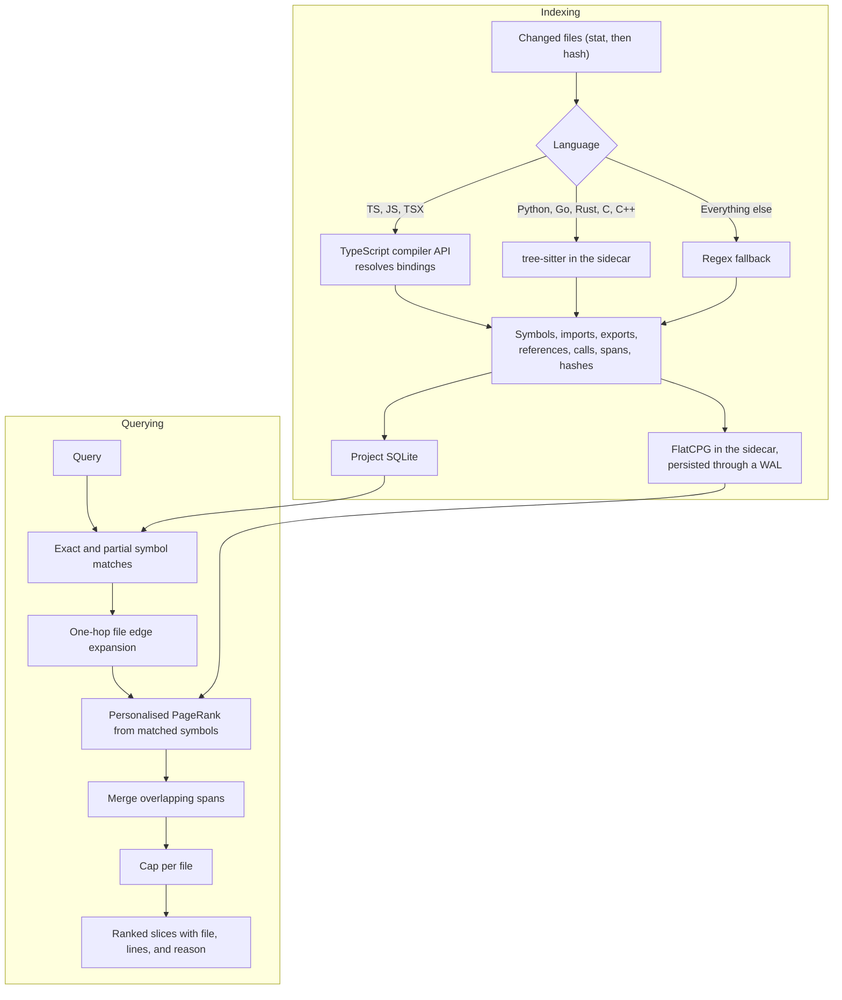
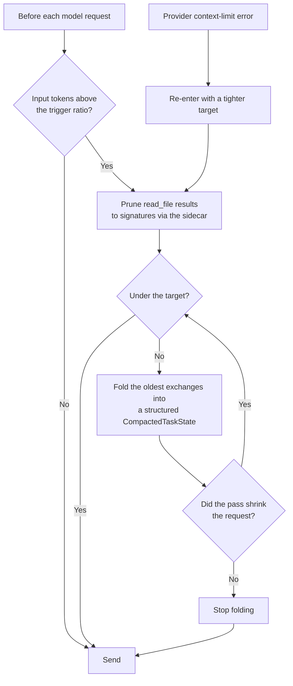
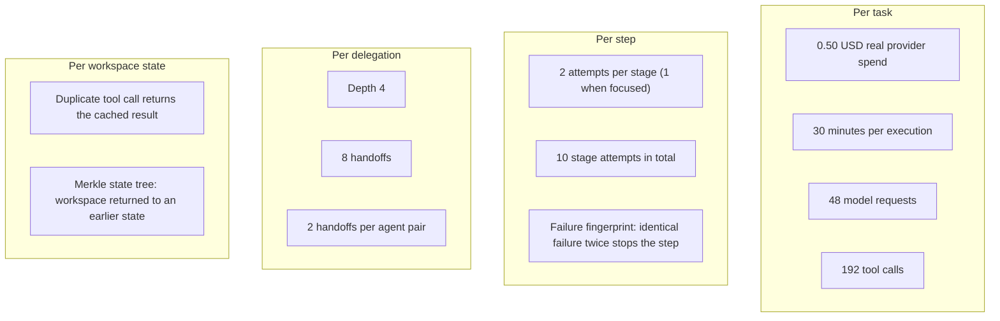
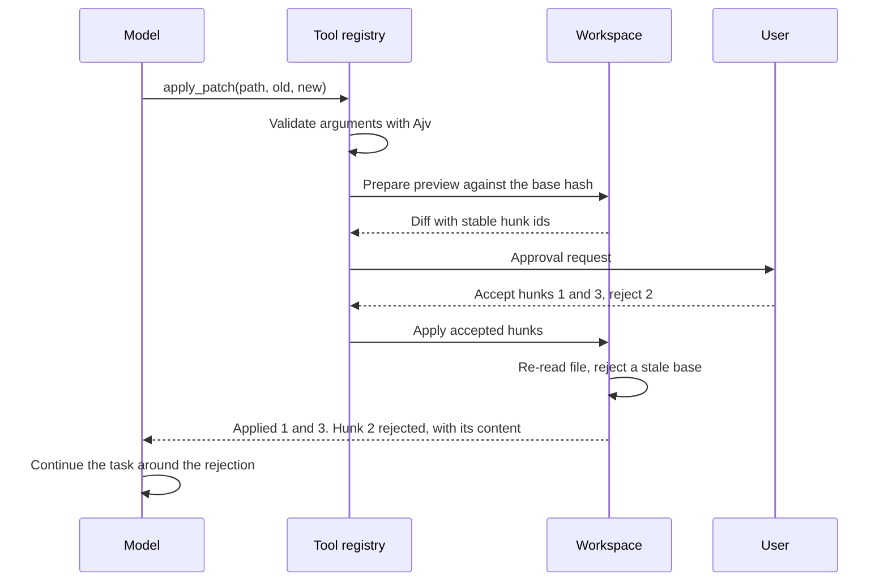
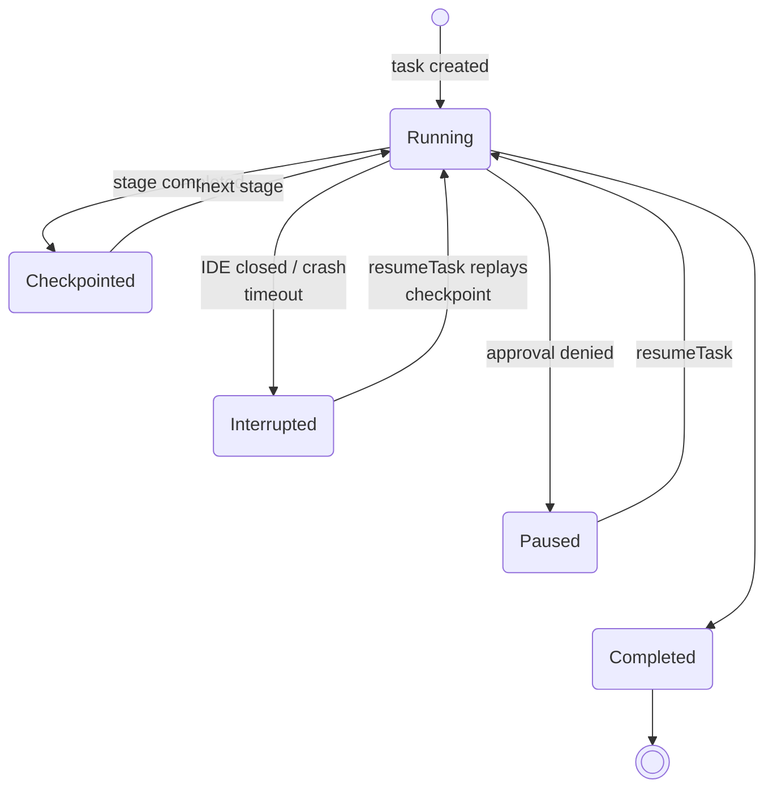

# Multi-Agent Architecture

How Agent Zero takes a coding task from a prompt to a verified change.

The system is built around one constraint: no model it uses exceeds 80B total
parameters, and most runs use models between 7B and 30B. A model that size
cannot hold a multi-file task in its head, cannot plan and implement and check
its own work in one pass, and produces unreliable structured output. Every
decision below follows from that.

---

## 1. Layers

The runtime is headless. Clients never construct orchestration, never hold
provider credentials, and never import Node-only packages into a browser
context. The TUI calls the service in-process; the desktop and browser go
through a loopback HTTP boundary with an SSE event stream. All three therefore
share the same durable state, routing, and safety policy.

The Rust sidecar is a separate process spoken to over line-delimited JSON-RPC on
stdin and stdout. It is optional: if the binary is missing, the features that
depend on it report a tool error and everything else continues.

---

## 2. What happens to a prompt

Not every prompt is a coding task. Sending a greeting through a five-stage
pipeline wastes five model calls and produces worse output than answering it.

Classification is syntactic, not a model call. A classifier that costs a round
trip to save a round trip is a bad trade at this scale.

The focused path exists because the general pipeline was measured spending
roughly 550 seconds on a single-file edit whose authoritative context was the
named file. On that path the runtime reads the file and its hash before the
Coder starts, removes `read_file` from the Coder's tools, caps it at two turns,
gives the Verifier the post-mutation snapshot and only compile or syntax tools,
and skips the rollback and replan graph.

---

## 3. The five-stage pipeline

The pipeline has a fixed shape but not a fixed length.

### Planner

Produces a small, testable plan from the objective, session history, and project
context. Read-only tools, cannot mutate the workspace.

Its reply may end with a fenced `subtasks` block. When it does, the orchestrator
replaces the single placeholder coding step with one step per subtask, up to
four. Dependencies are rewired rather than reassigned: the first inserted step
inherits the placeholder's dependencies so it still waits for retrieval, and the
Verifier now depends on the last inserted step so it still runs over the whole
change.

Three properties matter more than the mechanism.

- It degrades safely. A missing block, malformed JSON, a single entry, or
  entries with no prompt all yield no expansion, and the single generic coding
  step runs. A model too small to emit structured output loses nothing.
- It is bounded at four subtasks. Every extra step is another model call, and
  the Planner is told not to split work that touches one file.
- It survives a restart. Accepted expansions are stored in the orchestration
  state and replayed on resume, so an interrupted decomposed run does not reject
  `code-2` as an unknown step.

### Retriever

Not a model call. It queries the semantic index with the objective and the
Planner output, and asks for up to ten slices of at most forty lines each.

Making this deterministic removes a model call from every task and removes a
failure mode: a small model asked to choose files tends to name plausible paths
that do not exist.

### Coder

Receives the objective, the current project and manual context, the Planner
output, the retrieval slices, and prior stage summaries. It has workspace
mutation tools, read-only Git, shell tools, retrieval, and the Rust analysis
tools. Mutations and shell tools pass through approval.

One Coder call per coding step. Each call sees only its own slice of the
objective.

### Verifier

Runs syntax or compile checks, runs relevant tests, inspects the Git diff, and
reports exact commands and failures. It receives the list of files the run
actually produced, because a Verifier that has to guess what to inspect reads
one file out of five and concludes nothing.

Verification passes only when the final text carries `VERIFICATION_PASSED` as a
line-oriented token. Markdown decoration and a trailing checklist do not turn a
pass into a failure, and prose that merely mentions the token does not pass.

A result counts as evidence only if a real verification tool actually executed.
This is enforced because a Verifier once narrated calls to `js_verify`,
`py_verify`, `ts_verify`, `cs_verify`, and `go_verify`, none of which exist, and
reported success for all five without running anything.

### Reviewer

Receives the plan, retrieval evidence, implementation result, and verification
result. Read-only. Produces the final user-facing summary. For bounded
single-file work it completes deterministically instead of paying for a second
model to repeat the Verifier's checklist.

### Execution rules

Execution is sequential. Parallel agents editing one working tree conflict, and
recovery from a conflict is harder than the time saved.

Every stage is checkpointed in project SQLite before and after it runs.
`resumeTask()` reloads the checkpoint and skips completed stages.

---

## 4. Recovery

A failed verification is not a failed task.

Two rules constrain this.

A creation is not undone by deletion during recovery. `rollbackMutation` takes
`preserveCreatedFiles`, so edits to pre-existing files are reverted but a newly
created artifact is kept for the corrective pass to overwrite. This exists
because an early recovery cycle deleted the only copy of a five-file generated
result and left the empty directories behind.

A later user edit is never overwritten. If the current hash does not match what
the journal recorded, recovery stops rather than replacing work it did not
write.

Rollback covers approved workspace file mutations. It cannot reverse shell, Git,
network, package manager, or other external side effects, and it stops instead
of guessing when those occurred.

---

## 5. Routing

Every model request is placed on a provider at call time. No stage is pinned to
a provider.

Failover keeps the identical request and the same task checkpoint, so a provider
failure costs latency and never progress.

Every candidate carries a human-readable reason, for example
`economy bias (estimated cost 0.000042); preference 2; tools supported;
estimated context 4210/32768`. A rejected candidate says why it was rejected.
These are emitted as events and recorded as trace spans, so the routing decision
is visible live in the dashboard rather than inferred afterwards.

Two constraints are enforced at registration rather than by prompt. A provider
is rejected unless it is on the free-tier, pay-as-you-go, or local allowlist. A
model is dropped if its known total parameter count exceeds 80B.

---

## 6. Retrieval

The index is per project, keyed by the canonical project root. Two codebases
open at once cannot see each other's structure, symbols, or agent memory.

Ranking bands are explicit. An exact symbol match scores 120, an exported symbol
88, an ordinary symbol 76, a graph-only hit 64 to 75, a text hit 52. A candidate
the query actually named always outranks one only the graph relates.

Personalised PageRank runs with a restart probability of 0.15 for ten
iterations. It matters because one-hop expansion finds the direct caller but not
the thing two or three edges away that a change actually breaks. Results come
back ordered by descending mass, and that order is the contract: truncating an
unordered slice to a limit returns whichever related symbols were inserted into
the graph first, not the most related ones.

Poor retrieval is detected and recovered from. If the exact query matches
nothing, identifier and prompt terms are searched separately and the result is
marked `broadened`. If it matches too much, results are ranked and capped at two
per file and marked `narrowed`. If nothing survives, the result says so rather
than returning noise.

Slices carry their reason, so the dashboard can show why a chunk was in an
agent's context.

---

## 7. Compaction

Compaction is deterministic. It never calls a model.

The compacted state is fields, not prose: objective, plan, completed work,
failures, changed files with hashes, verification status, retrieved slices,
project rules from `AGENTS.md`, and open questions. Successive compactions merge
into the existing state rather than summarising a summary.

The most recent exchanges and the last user message are never folded. Project
rules survive every compaction event, which is what keeps a stated preference
applied late in a long task.

---

## 8. Stopping a stuck or runaway task

Twelve independent limits, at four scopes.

The last one is the interesting case. A run that edits a file, reverts it, and
edits it again succeeds at every individual step and produces different output
each time, so no per-step failure fingerprint fires. The workspace has still
made no progress. The sidecar hashes each post-mutation workspace state with
BLAKE3 into a rolling history and reports how many steps ago the same state
occurred. Snapshots are namespaced by task, because the sidecar keeps one
history for the process and two tasks touching the same file in the same
repository would otherwise collide.

Spend is measured from real provider usage, persisted alongside the task, and
survives a restart, so a resumed task keeps its budget rather than getting a
fresh one.

The ceilings are set against the evaluation's scoring formula, not chosen as
round numbers. Accuracy is multiplied by ten while cost and time enter a penalty
denominator, so a run halted just short of a correct answer scores far worse
than the same run taking longer to finish. The limits sit below the 2700 second
and $0.50 hard ceilings with margin and exist as runaway protection, not as a
target.

---

## 9. Human-in-the-loop review

Approval is not boolean only. A decision can carry accepted and rejected hunk
ids. Rejected hunks are returned into model context so the agent works around
them instead of retrying the same patch.

Every side-effecting tool declares `approval: "ask"`: file writes, creation,
deletion, patches, shell commands, Git staging, commits, checkout, merge, push,
and web access. Read-only tools run without a prompt.

---

## 10. Persistence and resume

Storage is split by scope. A global SQLite database holds user settings and
credential references. A per-project database holds sessions, tasks, events,
context items, orchestration checkpoints, workspace recovery journals, and trace
spans. The project id is derived from the canonical project root and every query
is scoped to it.

Model requests are cancellable. A resumed task starts a fresh call from the last
durable checkpoint rather than continuing an in-flight HTTP request.

---

## 11. Observability

Every task produces a span tree. Span kinds are `task`, `pipeline_step`,
`plan_expansion`, `agent`, `model_call`, `tool`, `provider_attempt`,
`compaction`, and `isolated_question`.

Each span records exact sanitized input and output, the context slices the agent
held with the reason each was selected, usage, timing, provider and model, and
cost. Usage is reported per model call and rolled up to agent, stage, and task,
because "how many tokens did this agent use" has no answer otherwise.

Elapsed time comes from the root task span. Nested spans describe overlapping
intervals, so summing them counts the same wall clock three or four times.

The dashboard polls while a task is running and reads the same persisted spans
afterwards. There is no separate live mode and historical mode.

---

## 12. Agents as data

Agent definitions are records, not code: id, system prompt, allowed tools,
delegation targets, model preference, step budget. `MultiAgentOrchestrator`
loads them from a registry and injects a generic `handoff_agent` tool. Adding or
changing an agent does not change orchestration code.

Definitions can be versioned with a project in `.agentic/agents/*.md`, using
YAML frontmatter for the registry fields and the Markdown body for the system
prompt.

`AGENTS.md` is deliberately separate. It carries project rules loaded into the
coding and review prompts, not agent identity or permissions. It is collected
hierarchically, nearest to root first, bounded to depth 4 and 24 files, and each
file is scoped to the directory it sits in so a monorepo package can state
conventions that differ from the root.

Tool boundaries are enforced by the orchestrator, not by prompts. If an agent
has both `allowedTools` and `delegatesTo`, every blocked registered tool is
exposed as an automatic delegation proxy. Otherwise a small model can bypass a
restriction by emitting a blocked tool name as if it had it.
